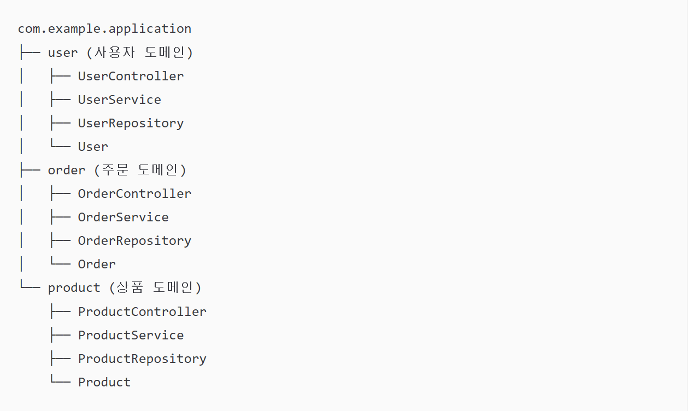

- 아키텍처 구조란?
    
    > 프로젝트의 구조와 원칙을 정의하는 과정으로 폴더 구조를 정리하는 것을 넘어, 각 구성 요소가 어떻게 상호작용하고 유지보수될 지를 명확히 하는 것
    > 
    
    **[아키텍처 설계의 핵심 요소]**
    
    - 프로젝트의 목적과 요구 사항의 명확한 정의
    - 설계 원칙을 문서화하고 공유
    - 설계 원칙은 유연해야 한다
    - 설계 원칙은 구체적이어야 한다
    
    **[아키텍처 설계의 장점]**
    
    - 팀원 간의 원활한 소통
    - 프로젝트의 일관성 유지
    - 유지보수의 용이성과 확장성
    
    **[대표적인 아키텍처 패턴]**
    
    - **모놀리식 아키텍처(Monolithic)**: FE, BE, DB를 하나로 통합하여 단순하고 빠른 초기 배포
    - **마이크로서비스 아키텍처(MSA)**: 기능을 작은 서비스 단위로 분리하여 독립적인 배포 및 확장이 가능
    - **계층형 아키텍처(Layered Architecture)**: 표현, 비즈니스, 데이터 계층 등으로 역할을 분리
    

- Swagger란?
    
    > Swagger란  웹 서비스 명세를 자동으로 문서화해주는 오픈소스 소프트웨어 프레임워크
    > 
    
    **[API 명세를 만드는 이유]**
    
    - FE, BE가 분리된 환경에서 데이터를 주고 받기 위해 API를 개발하는데, 이때 둘 사이의 소통을 위해 문서로 API의 사용법과 명세를 남기는 것이 효율적이기 때문
    
    **[Swagger 라이브러리 종류]**
    
    - **Spring-fox**: 2020년 이후로 업데이트가 중지됨(SpringBoot 3버전 이상 사용시 문제 발생 가능성)
    - **Spring-Doc**: 꾸준히 업데이트 중
    
    **[Swagger의 단점]**
    
    - 프로그램 배포 전에는 다른 팀에서 접근이 불가
    
    **[Swagger 외의 명세서 작성법]**
    
    1. **노션**
        - 마크다운을 통한 자유로운 작성
        - 프로그램 배포 전에도 FE팀에서 접근 가능
        - Swagger와 달리 수정과 추가를 직접 관리해야 함
    2. **Postman**
        - 설계, 테스트, 문서화 등 API 개발을 위한 다양한 기능
        - api 구현 전에 문서화 가능
    

- 도메인형 아키텍처란?
    
    > 비즈니스 로직에 중점을 둔 아키텍처, 도메인(비즈니스 기능) 중심으로 코드를 작성
    > 
    
    **[패키지 구조 예시]**
    
    
    
    **[도메인형 아키텍처 장점]**
    
    - 도메인별 응집도가 높아진다
        - 도메인의 흐름을 파악하기 쉽다
    - 도메인과 관련된 변경이 있을 때, 변경 범위가 적다
    - 유스케이스별로 세분화해서 표현이 가능하다
    
    **[도메인형 아키텍처 단점]**
    
    - 애플리케이션의 전반적인 흐름을 한 눈에 파악하기가 어렵다
        - 흐름 파악을 위해 여러 패키지를 왔다갔다 해야할 가능성이 높다
    - 관점에 따라 패키지 구분이 애매한 클래스들이 존재
        - ex) 최초 화면 페이지
    

- DDD vs 도메인형 아키텍처
    
    > DDD는 ‘모델링’에 도메인형 구조는 ‘코드 조직화’에  초점
    DDD를 적용하기 위해 도메인형 패키지 구조를 채택한다.
    > 
    
    **[DDD(Domain-Driven Design)]** 
    
    - DDD(Domain-Driven Design)는 복잡한 비즈니스 로직 해결을 위한 설계 방법론(철학)
    - 구성요소
        - 엔티티(Entity), 밸류 객체(Value Object), 도메인 서비스(Domain Service), 레포지토리(Repository) 등
    
    **[도메인형 아키텍처]**
    
    - DDD를 구현하기 위해 도메인(기능)별로 코드를 구성하는 방식
    - 코드의 디렉토리 구조를 도메인 기능 단위로 묶는 방식
    - 관련 기능의 높은 응집도, 계층간의 낮은 결합도를 유지
    - 계층형 아키텍처의 단점인 ‘기술 위주의 패키지 분리’를 극복하기 위해 사용되며, 특정 도메인 변경이 다른 도메인에 영향을 미치지 않도록 설계
    
    **[결론]**
    
    - DDD는 "무엇을 어떻게 모델링할 것인가"에 대한 지침이고, 도메인형 아키텍처는 그 모델을 "어떻게 코드 구조로 보여줄 것인가"에 대한 답변입니다
    

- 왜 DTO를 사용하는가?
    
    > DTO는 Data Transfet Object의 약자로 ‘데이터 전송 객체’를 의미한다.
    > 
    
    계층(View, Controller, Service 등) 간 데이터 전송을 위해 도메인 모델 대신 사용되는 객체
    
    **[Entity와 DTO의 역할 차이]**
    
    - **Entity**: DB와 직접 연결되는 핵심 모델
    - **DTO**: View나 API를 위한 가공된 데이터 객체
    
    **[Entity(도메인 모델) 대신 DTO 사용 이유]**
    
    1. **관심사의 분리**
        - Entity는 데이터가 저장되는 DB와 직접적으로 관련되어 있는 객체로, 테이블의 구조에 맞게 설계된 Entity는 최대한 수정하지 않는 것이 안정적인 모델이다.
        - 그에 반해, 표현 계층에서 View의 요구사항에 따라 전달되는 데이터의 구조가 자주 바뀔 수 있다.
        - 또한 Entity는 View에 노출하면 안되는 민감 정보를 가지고 있어, View에 전달하면 안된다.
        
        > 즉, 각 계층의 관심사가 달라서 생기는 차이이고, 각 계층에 맞게 데이터를 담는 객체도 구분해주는 것이 필요하다.
        > 
        
    2. **서버(Controller)의 호출을 최소화하기 위해**
        - 원격 인터페이스로 작업을 할 때, 호출에 따른 비용은 매우 비싸다.
        - 요청에 대한 모든 데이터를 보관할 수 있는 데이터 전송 객체를 만들어서 이를 해결한다.
        - DTO를 통해 한 번의 호출로 여러 매개변수를 일괄 처리해서 서버의 왕복을 줄인다.
    

- 컨버터는 왜 사용하는가?
    
    > 컨버터(Converter)란 DTO를 Entity로, 혹은 Entity를 DTO로 변환하는 로직
    > 
    
    **[컨버터가 필요한 이유]**
    
    - Entity는 실제 DB 테이블과 매핑되는 클래스, DTO는 API를 통해 client에 전달할 데이터 양식이다.
    - 둘의 목적이 다르기 때문에 형태를 바꿔줘야 하는데, **이 변환 작업을 담당하는 코드**를 컨버터라고 한다.
    
    **[주요 역할]**
    
    - **계층간 분리**: Entity가 변경되어도 API 스펙은 그대로 유지할 수 있어서 유지보수가 용이해진다.
    - **보안**: DB에 저장된 민감 정보가 노출되는 것을 방지한다.
    - **데이터 가공**: DB에는 따로 저장이 되어 있지만, 화면에 합쳐서 보여줘야할 때 컨버터에서 이 로직을 처리한다.
    
    **[실제 사용 방법]**
    
    1. **수동변환**: `toEntity()`, `fromEntity()` 같은 메서드를 만들어서 옮겨 담는다.
    2. **라이브러리 활용**: MapStruct나 ModelMapper 같은 라이브러리를 통해 설정해서 사용한다.