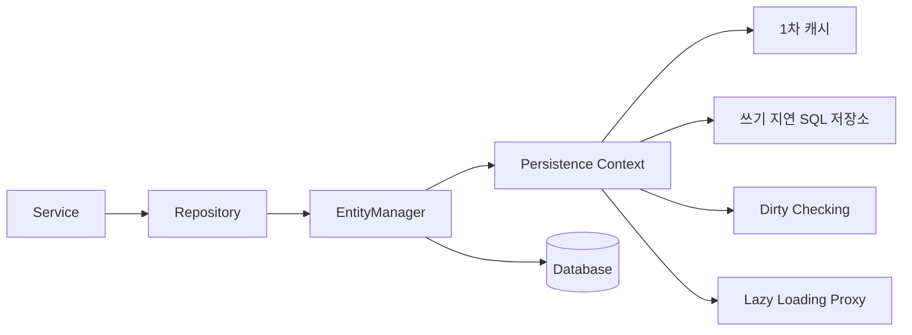
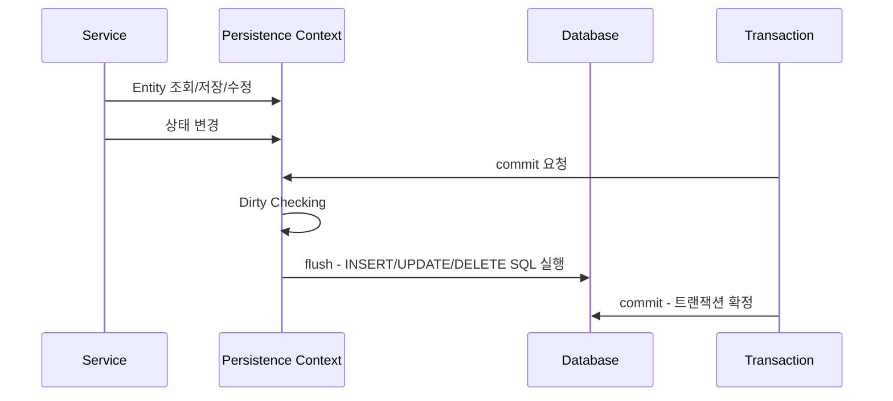

# 1. JPA란?

## 한 줄 정의

JPA는 Java 객체와 관계형 데이터베이스 테이블을 매핑하기 위한 ORM 표준 인터페이스이다.

조금 더 정확히 말하면, JPA 자체는 구현체가 아니라 **표준 명세**이다. 실제 동작은 Hibernate 같은 구현체가 담당한다.

```text
JPA = ORM 표준 인터페이스/명세
Hibernate = JPA를 구현한 대표 구현체
Spring Data JPA = JPA를 더 편하게 쓰도록 Repository 추상화를 제공하는 Spring 프로젝트
```

---

## 왜 필요한가

JPA는 단순히 “SQL을 덜 쓰기 위한 도구”가 아니다. 핵심은 **객체 지향 모델과 관계형 데이터베이스 모델 사이의 불일치를 줄이는 것**이다.

Java에서는 데이터를 객체로 다룬다.

```java
Member member = new Member("kim", "kim@example.com");
member.changeNickname("spring-user");
```

하지만 DB에서는 데이터를 테이블과 행으로 다룬다.

```sql
UPDATE member
SET nickname = 'spring-user'
WHERE member_id = 1;
```

JPA가 없다면 개발자는 객체 상태 변경을 직접 SQL로 바꾸고, SQL 결과를 다시 Java 객체로 바꾸는 작업을 계속 해야 한다.

```text
Java Object
→ SQL
→ ResultSet
→ Java Object
→ SQL
→ ...
```

이 반복 작업이 커지면 개발자는 비즈니스 로직보다 SQL 매핑 코드에 더 많은 에너지를 쓰게 된다.

---

## 코드/개념적으로 어떻게 사용되는가

Spring Boot에서 JPA는 보통 세 층으로 보인다.

```text
Entity
Repository
Service
```

### Entity

Entity는 DB 테이블과 매핑되는 Java 객체이다.

```java
@Entity
@Table(name = "member")
@Getter
@NoArgsConstructor(access = AccessLevel.PROTECTED)
public class Member {

    @Id
    @GeneratedValue(strategy = GenerationType.IDENTITY)
    private Long id;

    @Column(nullable = false)
    private String nickname;

    @Column(nullable = false, unique = true)
    private String email;
}
```

여기서 중요한 것은 Entity가 단순 DTO가 아니라는 점이다. Entity는 JPA가 영속성 컨텍스트에서 관리하는 객체이다.

### Repository

Repository는 Entity를 DB에 저장하거나 조회하는 입구이다.

```java
public interface MemberRepository extends JpaRepository<Member, Long> {

    Optional<Member> findByEmail(String email);
}
```

`JpaRepository<Member, Long>`에서 `Member`는 관리할 Entity 타입이고, `Long`은 Entity의 ID 타입이다.

### Service

Service는 Repository를 사용해서 비즈니스 흐름을 만든다.

```java
@Transactional(readOnly = true)
public MemberResponse getMyPage(Long memberId) {
    Member member = memberRepository.findById(memberId)
            .orElseThrow(() -> new MemberException(MemberErrorCode.NOT_FOUND));

    return MemberResponse.from(member);
}
```

이 흐름은 단순 조회처럼 보이지만 실제로는 다음 일이 일어난다.

```text
Repository 호출
→ EntityManager가 DB 조회
→ 조회된 Entity를 영속성 컨텍스트에 저장
→ 같은 트랜잭션 안에서 Entity 상태 추적
→ 필요하면 flush 시점에 SQL 반영
```

---

## JPA의 핵심 구조

JPA를 이해할 때 가장 중요한 중심은 **영속성 컨텍스트**이다.



영속성 컨텍스트는 Entity를 관리하는 메모리 공간이다. 이 공간 덕분에 JPA는 다음 기능을 제공한다.

| 기능 | 의미 |
|---|---|
| 1차 캐시 | 같은 트랜잭션 안에서 같은 Entity를 다시 조회할 때 DB를 다시 가지 않을 수 있음 |
| 동일성 보장 | 같은 ID의 Entity는 같은 객체 인스턴스로 관리될 수 있음 |
| Dirty Checking | Entity 필드 변경을 감지해 UPDATE SQL을 자동 생성 |
| 쓰기 지연 | INSERT/UPDATE/DELETE SQL을 즉시 보내지 않고 flush 시점까지 모아둘 수 있음 |
| Lazy Loading | 연관 Entity를 실제 사용할 때 조회할 수 있음 |

Entity는 영속성 컨텍스트 안에서 상태가 바뀐다.

```text
비영속(new/transient)
→ 영속(managed)
→ 준영속(detached)
→ 삭제(removed)
```

예를 들어 `new Member()`로 만든 객체는 아직 JPA가 관리하지 않는 비영속 상태이다.  
`memberRepository.save(member)` 또는 `entityManager.persist(member)` 이후에는 영속 상태가 되고, 트랜잭션 안에서 변경 감지 대상이 된다.

이 차이를 이해하면 “왜 조회한 Entity의 필드만 바꿨는데 UPDATE가 나가는지”, “왜 트랜잭션 밖에서 LAZY 로딩이 터지는지”를 더 자연스럽게 이해할 수 있다.

> 참고: [Jakarta Persistence 3.2 Specification](https://jakarta.ee/specifications/persistence/3.2/jakarta-persistence-spec-3.2)

---

## 무엇과 구별해야 하는가

### JPA vs Hibernate

```text
JPA = 표준 규칙
Hibernate = 그 규칙을 구현한 실제 엔진
```

코드에서 `@Entity`, `@Id`, `EntityManager` 같은 개념은 JPA 표준에 속한다. 하지만 실제 SQL 생성, 프록시 생성, 지연 로딩 구현 방식 등은 Hibernate가 담당하는 경우가 많다.

### JPA vs Spring Data JPA

```text
JPA = ORM 표준
Spring Data JPA = Repository 작성 편의 기능
```

예를 들어 `EntityManager`를 직접 쓰면 JPA에 더 가까운 코드이다.

```java
Member member = entityManager.find(Member.class, memberId);
```

반면 `JpaRepository`를 쓰면 Spring Data JPA의 추상화를 사용하는 것이다.

```java
memberRepository.findById(memberId);
```

Spring Data JPA는 내부에서 JPA를 사용하지만, 개발자가 Repository 인터페이스만으로 조회/저장을 쉽게 할 수 있게 도와준다.

### JPA vs MyBatis

```text
JPA = 객체 상태를 중심으로 DB와 동기화
MyBatis = SQL을 직접 작성하고 결과를 객체에 매핑
```

최근에서는 JPA와 MyBatis가 모두 쓰인다. 복잡한 통계성 쿼리, 레거시 SQL 중심 시스템에서는 MyBatis나 native query가 편할 수 있다. 반면 도메인 객체 중심의 CRUD와 연관관계 탐색이 많은 서비스에서는 JPA가 생산성을 높인다.

---

## 왜 중요한가

JPA를 쓰면 단순 CRUD 생산성은 크게 올라간다. 하지만 동시에 **조회 성능을 모르면 위험한 추상화**가 된다.

JPA 코드를 리뷰할 때는 다음을 꼭 봐야 한다.

```text
1. Entity 연관관계가 무분별하게 양방향으로 열려 있지 않은가?
2. @ManyToOne, @OneToOne이 기본 EAGER로 방치되어 있지 않은가?
3. Service에서 LAZY 연관 필드를 반복 접근해 N+1이 발생하지 않는가?
4. 트랜잭션 범위 밖에서 Lazy 필드를 접근하지 않는가?
5. API 응답에 Entity를 그대로 반환하지 않는가?
6. 페이징 쿼리에 컬렉션 Fetch Join을 사용하고 있지 않은가?
```

---

## 최신/현업 관점

Spring Boot 3 이후는 `javax.persistence.*`가 아니라 `jakarta.persistence.*` 패키지를 사용한다. 따라서 최신 Spring Boot 프로젝트에서는 예전 블로그 코드의 `javax.persistence.Entity`를 그대로 따라 쓰면 import가 맞지 않을 수 있다.

또한 최근에 “모든 조회를 Entity로 가져와서 DTO로 변환”하는 방식만 고집하지 않는다. API 응답 전용 조회에서는 다음 전략을 섞는다.

```text
단순 CRUD / 도메인 변경
→ Entity 조회 + Dirty Checking

목록 조회 / 화면 응답
→ DTO Projection, QueryDSL, JPQL select new, native query 등 고려

연관 객체 일부가 필요한 조회
→ Fetch Join 또는 @EntityGraph

대량 데이터 / 통계 / 복잡한 조건
→ QueryDSL, native SQL, 별도 read model 고려
```

---

## 흔한 오해

### JPA를 쓰면 SQL을 몰라도 된다

아니다. JPA는 SQL을 대신 만들어주지만, 결국 DB에 실행되는 것은 SQL이다.  
JPA를 제대로 쓰려면 실행 SQL을 읽고, 인덱스와 조인 구조를 이해해야 한다.

### Repository를 쓰면 DB 접근이 전부 자동 최적화된다

아니다. Repository는 편한 입구일 뿐이다. 잘못된 연관관계와 fetch 전략은 N+1, 불필요한 join, 메모리 증가 문제를 만든다.

### Entity는 API 응답 DTO로 바로 써도 된다

피해야 한다. Entity를 그대로 응답하면 Lazy Loading, 순환 참조, 내부 필드 노출, API 스펙 변경 취약성 문제가 생긴다.

---

# 2. N+1 문제란?

## 한 줄 정의

N+1 문제는 처음에 목록을 조회하는 쿼리 1번이 실행된 뒤, 각 결과의 연관 객체를 조회하기 위해 추가 쿼리가 N번 더 실행되는 성능 문제이다.

```text
1번 쿼리: Mission 목록 조회
N번 쿼리: 각 Mission의 Store 조회
총 1 + N번 쿼리 발생
```

---

## 왜 발생하는가

N+1은 보통 다음 조건이 함께 있을 때 발생한다.

```text
1. Entity 목록을 조회한다.
2. 각 Entity가 연관 Entity를 가지고 있다.
3. 반복문 안에서 연관 Entity를 접근한다.
4. JPA가 그 연관 Entity를 아직 가져오지 않았다.
```

예를 들어 홈 화면에서 미션 목록을 조회한다고 하자.

```java
List<Mission> missions = missionRepository.findAvailableMissionsWithCursor(
        memberId,
        regionId,
        excludedStatuses,
        now,
        cursor,
        pageable
);

return missions.stream()
        .map(mission -> new MissionResponse(
        mission.getId(),
                mission.getStore().getName(), // 여기서 store 접근
                mission.getRewardPoint()
        ))
                .toList();
```

만약 `Mission.store`가 LAZY이고 fetch join을 쓰지 않는다면 미션 목록 조회에서는 Mission만 조회된다.

```sql
select m.*
from mission m
         join store s on m.store_id = s.store_id
where s.region_id = ?;
```

그런데 DTO 변환 중 `mission.getStore().getName()`을 호출하면 각 Mission마다 Store가 필요해진다.

```sql
select * from store where store_id = 1;
select * from store where store_id = 2;
select * from store where store_id = 3;
...
```

결과적으로 다음 흐름이 된다.

```text
Mission 목록 조회 1번
+ Mission 개수만큼 Store 조회 N번
= N+1
```

---

## 코드/개념적으로 어떻게 사용되는가

N+1은 코드에 직접 “N+1”이라고 보이지 않는다. SQL 로그를 봐야 발견된다.

```yaml
spring:
  jpa:
    properties:
      hibernate:
        format_sql: true
    show-sql: true
```

`show-sql` 대신 로깅 설정이나 p6spy, datasource-proxy 같은 도구를 사용해 SQL과 실행 횟수를 확인하기도 한다.

N+1이 의심되는 코드는 대부분 이런 형태를 가진다.

```java
List<MemberMission> memberMissions =
        memberMissionRepository.findByMemberId(memberId);

return memberMissions.stream()
        .map(memberMission -> MemberMissionResponse.builder()
                .missionTitle(memberMission.getMission().getTitle())
        .storeName(memberMission.getMission().getStore().getName())
        .status(memberMission.getStatus())
        .build())
        .toList();
```

위 코드는 겉으로는 깔끔한 stream 변환이지만, 내부에서 `mission`, `store`를 반복 접근하면서 추가 쿼리가 발생할 수 있다.

---

## 지연 로딩 때문에만 생기는가?

자주 하는 오해가 있다.

```text
N+1은 LAZY 때문에만 생긴다.
```

정확히는 아니다.

LAZY에서는 연관 객체를 실제 사용할 때 추가 쿼리가 나가므로 N+1이 잘 드러난다. 하지만 EAGER라고 안전한 것도 아니다. JPQL로 루트 Entity를 조회할 때 EAGER 연관관계를 만족시키기 위해 추가 쿼리가 발생할 수 있다.

즉, 핵심은 LAZY/EAGER 자체가 아니라 **조회 쿼리가 필요한 연관 데이터를 한 번에 가져오도록 설계되어 있는가**이다.

---

## 해결 방법

N+1 해결은 무조건 Fetch Join만 쓰는 것이 아니다. 조회 목적에 따라 방법이 다르다.

| 방법 | 적합한 상황 | 주의점 |
|---|---|---|
| Fetch Join | 특정 연관 Entity를 반드시 함께 써야 할 때 | 컬렉션 fetch join + 페이징 주의 |
| @EntityGraph | Repository 메서드에 fetch 전략을 선언적으로 붙이고 싶을 때 | 복잡한 조건에는 한계 |
| Batch Size | 여러 LAZY 로딩을 IN 쿼리로 묶고 싶을 때 | 설정값 튜닝 필요 |
| DTO Projection | 화면에 필요한 필드만 바로 조회할 때 | 변경 감지 대상 Entity가 아님 |
| QueryDSL | 조건이 복잡하고 동적 쿼리가 많을 때 | 학습 비용 있음 |

> 참고: [Hibernate ORM User Guide - Fetching](https://docs.jboss.org/hibernate/orm/current/userguide/html_single/Hibernate_User_Guide.html#fetching)

구체적인 Fetch Join 예시는 5번, `@EntityGraph` 예시는 6번에서 따로 다룬다.  
N+1 섹션에서는 “목록 조회 후 반복문에서 연관 객체를 건드리면 추가 쿼리가 늘어날 수 있다”는 원인을 먼저 잡는 것이 핵심이다.

---

## 왜 중요한가

N+1은 개발 초기에는 잘 안 보인다. 데이터가 3개일 때는 쿼리 4번이 큰 문제가 아니다. 하지만 데이터가 100개가 되면 쿼리가 101번, 연관관계가 중첩되면 수백 번으로 늘어난다.

특히 다음 API에서 자주 발생한다.

```text
홈 화면 목록
마이페이지 요약
내 미션 목록
리뷰 목록
알림 목록
관리자 목록 페이지
```

즉, 미션처럼 “화면을 구현하기 위한 Service”를 만들 때 N+1은 반드시 의식해야 한다.

---

## AI 생성 코드 리뷰 포인트

AI가 JPA 코드를 만들 때 자주 하는 실수는 다음이다.

```text
1. Repository에서 findAll()로 Entity 목록을 가져온다.
2. Service에서 stream으로 DTO 변환한다.
3. 변환 중 연관 Entity getter를 계속 호출한다.
4. Fetch Join, EntityGraph, DTO Projection을 고려하지 않는다.
```

AI 코드가 겉으로는 깔끔해도 SQL 로그를 확인해야 한다.

```java
missions.stream()
        .map(m -> m.getStore().getName())
```

이런 코드가 보이면 바로 질문해야 한다.

```text
이 store는 이미 함께 조회되었는가?
아니면 여기서 Lazy Loading이 N번 발생하는가?
```

---

# 3. 지연로딩과 즉시로딩의 차이는?

## 한 줄 정의

지연로딩은 연관 Entity를 실제 사용할 때 조회하는 방식이고, 즉시로딩은 루트 Entity를 조회할 때 연관 Entity까지 바로 조회하려는 방식이다.

```text
LAZY = 필요할 때 조회
EAGER = 처음부터 조회
```

---

## 코드/개념적으로 어떻게 사용되는가

JPA 연관관계에 `fetch` 옵션으로 설정한다.

```java
@ManyToOne(fetch = FetchType.LAZY)
@JoinColumn(name = "store_id")
private Store store;
```

```java
@ManyToOne(fetch = FetchType.EAGER)
@JoinColumn(name = "store_id")
private Store store;
```

JPA 기본값은 관계 종류에 따라 다르다.

| 연관관계 | JPA 기본 fetch 전략 |
|---|---|
| `@ManyToOne` | EAGER |
| `@OneToOne` | EAGER |
| `@OneToMany` | LAZY |
| `@ManyToMany` | LAZY |

이 기본값 때문에 `@ManyToOne`, `@OneToOne`에 `fetch = FetchType.LAZY`를 명시하는 경우가 많다.

```java
@ManyToOne(fetch = FetchType.LAZY)
@JoinColumn(name = "member_id")
private Member member;
```

연관관계를 매핑할 때는 fetch 전략과 함께 **연관관계의 주인**도 같이 봐야 한다.

```java
@ManyToOne(fetch = FetchType.LAZY)
@JoinColumn(name = "member_id")
private Member member;
```

위처럼 FK 컬럼(`member_id`)을 가진 쪽이 보통 연관관계의 주인이다.  
예를 들어 `MemberMission`은 `Member`와 `Mission`을 참조하는 FK를 가지므로, 회원이 어떤 미션에 도전했는지 저장하는 주체는 `MemberMission`이다.

반대로 `Member`에 있는 `List<MemberMission>` 같은 컬렉션은 조회 편의를 위한 역방향 관계에 가깝다. 모든 관계를 양방향으로 만들 필요는 없고, 현재 API에서 자연스럽게 탐색해야 하는 방향이 있을 때만 추가하는 편이 좋다.

`cascade`와 `orphanRemoval`도 연관관계에서 자주 같이 고민한다.

| 옵션 | 의미 | 쓸 만한 경우 |
|---|---|---|
| `cascade` | 부모 Entity의 저장/삭제 작업을 자식에게 전파 | Review 저장 시 ReviewPhoto도 함께 저장 |
| `orphanRemoval` | 부모 컬렉션에서 빠진 자식을 고아 객체로 보고 삭제 | Review에서 사진을 제거하면 ReviewPhoto도 삭제 |

두 옵션은 편하지만 생명주기가 강하게 묶인다. 그래서 `Member`와 `Mission`처럼 독립적으로 존재하는 Entity 사이에는 조심해서 쓰고, `Review`와 `ReviewPhoto`처럼 부모 없이는 의미가 약한 관계에 더 잘 어울린다.

---

## LAZY는 어떻게 동작하는가

지연로딩은 실제 Entity를 바로 채우지 않고 프록시 객체를 넣어둔다.

```text
Mission 조회
→ mission.store에는 실제 Store가 아니라 Store 프록시가 들어감
→ store.getName() 같은 실제 접근이 일어나는 순간 DB 조회
```

예시:

```java
Mission mission = missionRepository.findById(id).orElseThrow();

// 이 시점까지 store 조회가 안 됐을 수 있음
Store store = mission.getStore();

// 실제 필드 접근 시 초기화
String storeName = store.getName();
```

단, Lazy Loading은 영속성 컨텍스트가 열려 있어야 안전하게 동작한다. 트랜잭션 밖에서 프록시 초기화를 시도하면 `LazyInitializationException`이 발생할 수 있다.

---

## EAGER는 어떻게 동작하는가

즉시로딩은 Entity를 조회할 때 연관 Entity도 바로 가져오려 한다.

```java
@ManyToOne(fetch = FetchType.EAGER)
private Store store;
```

이렇게 해두면 Mission을 조회할 때 Store도 함께 필요하다고 판단한다.

하지만 여기서 중요한 점은 “항상 내가 원하는 형태의 join 한 방으로 최적화된다”가 아니라는 점이다. JPQL이나 Repository 메서드 조회 방식에 따라 추가 쿼리로 연관 Entity를 가져올 수 있고, 이 과정에서 N+1이 발생할 수도 있다.

---

## 왜 최근 LAZY를 기본으로 권장하는가

대부분의 API는 같은 Entity를 조회하더라도 필요한 연관 데이터가 다르다.

예를 들어 `Mission`이 있다고 하자.

```text
홈 화면: Mission + Store 이름 필요
관리자 화면: Mission + Store + Region 필요
미션 상세: Mission + Store + Review 목록 필요
미션 상태 변경: Mission 자체만 필요
```

만약 Entity 매핑 자체를 EAGER로 해두면, 미션 상태 변경처럼 Mission만 필요한 경우에도 Store가 따라올 수 있다.  
즉, Entity의 기본 로딩 전략이 특정 API 요구사항에 종속된다.

아래와 같이 될수도 있다.

```text
Entity 연관관계는 기본적으로 LAZY
각 조회 API에서 필요한 연관 데이터는 Fetch Join, EntityGraph, Projection으로 명시
```

이 방식이 유지보수와 성능 예측에 유리하다.

---

## 비교 정리

| 구분 | LAZY | EAGER |
|---|---|---|
| 조회 시점 | 실제 사용할 때 | 루트 Entity 조회 시점 |
| 장점 | 불필요한 조회 감소 | 항상 필요한 관계라면 코드가 단순 |
| 단점 | 트랜잭션 밖 접근 시 LazyInitializationException 가능, N+1 가능 | 불필요한 join/추가 쿼리, N+1 가능 |
| 기본 전략 | 권장되는 경우가 많음 | 신중하게 사용 |
| 해결 보완 | Fetch Join, EntityGraph, Batch Size | 명시적 fetch 계획으로 대체 권장 |

정리하면 LAZY/EAGER는 연관 객체를 언제 가져올지에 대한 기본 전략일 뿐이다.  
성능은 결국 각 조회 API에서 필요한 연관 데이터를 Fetch Join, EntityGraph, Projection 등으로 얼마나 명확하게 가져오느냐에 달려 있다.

> 참고: [Jakarta Persistence - FetchType API](https://jakarta.ee/specifications/persistence/3.2/apidocs/jakarta.persistence/jakarta/persistence/fetchtype), [Jakarta Persistence - CascadeType API](https://jakarta.ee/specifications/persistence/3.2/apidocs/jakarta.persistence/jakarta/persistence/cascadetype)

---

# 4. JPQL란?

## 한 줄 정의

JPQL은 DB 테이블이 아니라 JPA Entity와 그 필드를 대상으로 작성하는 객체 지향 쿼리 언어이다.

```text
SQL  = table, column 기준
JPQL = Entity, field 기준
```

---

## 왜 필요한가

Spring Data JPA의 메서드 이름 쿼리는 간단한 조건에서는 편하다.

```java
List<Member> findByNicknameAndDeletedAtIsNull(String nickname);
```

하지만 조건이 복잡해지면 메서드 이름이 길어지고 읽기 어려워진다.

```java
findByStoreRegionIdAndIsActiveTrueAndEndedAtAfterOrderByIdDesc(...)
```

이럴 때 `@Query`로 JPQL을 직접 작성하면 의도가 더 명확해진다.

```java
@Query("""
    select m
    from Mission m
    join m.store s
    where s.region.id = :regionId
      and m.isActive = true
      and (m.endedAt is null or m.endedAt >= CURRENT_TIMESTAMP)
    order by m.id desc
""")
List<Mission> findAvailableMissions(
        @Param("regionId") Long regionId
);
```

---

## 코드/개념적으로 어떻게 사용되는가

JPQL은 Repository에서 `@Query`와 함께 자주 사용한다.

```java
public interface MissionRepository extends JpaRepository<Mission, Long> {

    @Query("""
        select m
        from Mission m
        join m.store s
        where s.region.id = :regionId
          and m.isActive = true
    """)
    Page<Mission> findAvailableMissionsByRegion(
            @Param("regionId") Long regionId,
            Pageable pageable
    );
}
```

여기서 JPQL의 `Mission`, `m.store`, `s.region.id`는 DB 테이블/컬럼명이 아니라 Java Entity와 필드명이다.

만약 Entity가 이렇게 생겼다면:

```java
@Entity
public class Mission {

    @ManyToOne(fetch = FetchType.LAZY)
    private Store store;

    private Boolean isActive;
}
```

JPQL에서는 DB의 `store_id` 컬럼을 직접 쓰는 게 아니라 `m.store`처럼 객체 그래프를 탐색한다.

---

## SQL과 JPQL의 차이

| 구분 | SQL | JPQL |
|---|---|---|
| 대상 | 테이블, 컬럼 | Entity, 필드 |
| 반환 | 행/컬럼 | Entity, DTO, 스칼라 값 |
| join 기준 | FK 컬럼 | 객체 연관관계 |
| DB 종속성 | DB 문법에 종속 | JPA 구현체가 SQL로 변환 |
| 예시 | `select * from mission` | `select m from Mission m` |

예시:

```sql
select *
from mission m
join store s on m.store_id = s.store_id
where s.region_id = ?;
```

JPQL:

```java
@Query("""
    select m
    from Mission m
    join m.store s
    where s.region.id = :regionId
""")
List<Mission> findByStoreRegionId(@Param("regionId") Long regionId);
```

---

## JPQL의 반환 방식

JPQL은 Entity만 반환하는 것이 아니다.

### Entity 반환

```java
@Query("select m from Mission m where m.id = :id")
Optional<Mission> findMission(@Param("id") Long id);
```

### 특정 필드 반환

```java
@Query("select m.title from Mission m where m.id = :id")
Optional<String> findTitle(@Param("id") Long id);
```

### DTO Projection

```java
@Query("""
    select new com.example.mission.dto.MissionSummaryDto(
        m.id,
        m.title,
        s.name,
        m.rewardPoint
    )
    from Mission m
    join m.store s
    where s.region.id = :regionId
""")
Page<MissionSummaryDto> findMissionSummaries(
        @Param("regionId") Long regionId,
        Pageable pageable
);
```

DTO Projection은 화면 응답에 필요한 필드만 가져올 수 있어 목록 API에서 자주 고려된다.

---

## 왜 중요한가

JPQL은 JPA의 추상화와 SQL 최적화 사이의 중간 지점이다.

```text
메서드 이름 쿼리
→ 간단하지만 복잡한 조건에 약함

JPQL
→ Entity 중심으로 명확하게 쿼리 작성 가능

Native SQL
→ DB 특화 기능 사용 가능하지만 JPA 추상화 이점 감소
```
미션에서 “페이징 부분은 @Query를 통해 구현”하라고 한 이유도, 단순 메서드 이름 쿼리보다 화면 요구사항을 명확히 표현하기 위해서라고 보면 된다.

---

## 주의점

### JPQL은 DB 컬럼명이 아니라 Entity 필드명을 쓴다

```java
// 잘못된 예: DB 컬럼명을 JPQL에 사용
@Query("select m from Mission m where m.store_id = :storeId")
```

```java
// 올바른 예: Entity 필드 탐색
@Query("select m from Mission m where m.store.id = :storeId")
```

### 벌크 JPQL은 영속성 컨텍스트와 불일치할 수 있다

JPQL의 bulk update/delete는 영속성 컨텍스트를 거치지 않고 DB에 직접 반영된다. 따라서 이미 영속성 컨텍스트에 올라와 있는 Entity 상태와 DB 상태가 달라질 수 있다. 벌크 쿼리 후에는 `clearAutomatically`나 `EntityManager.clear()` 등을 고려해야 한다.

### Fetch Join과 페이징을 함께 쓸 때 조심해야 한다

특히 1:N 컬렉션 Fetch Join에 `Pageable`을 붙이면 DB 페이징이 기대대로 동작하지 않거나 메모리 페이징 문제가 생길 수 있다.

> 참고: [Spring Data JPA Reference - JPA Query Methods](https://docs.spring.io/spring-data/jpa/reference/jpa/query-methods.html), [Jakarta Persistence - Query API](https://jakarta.ee/specifications/persistence/3.2/apidocs/jakarta.persistence/jakarta/persistence/query)

---

# 5. Fetch Join란?

## 한 줄 정의

Fetch Join은 JPQL에서 연관 Entity를 조회 결과와 함께 즉시 로딩하도록 지정하는 join 방식이다.

일반 join은 조건을 걸거나 필터링하기 위한 join이고, fetch join은 **연관 객체를 영속성 컨텍스트에 함께 채워 넣기 위한 join**이다.

---

## 코드/개념적으로 어떻게 사용되는가

예를 들어 `Mission`을 조회하면서 `Store`도 반드시 필요하다고 하자.

일반 JPQL:

```java
@Query("""
    select m
    from Mission m
    join m.store s
    where s.region.id = :regionId
""")
List<Mission> findMissions(@Param("regionId") Long regionId);
```

이 쿼리는 `store`를 join 조건에 사용하지만, `Mission.store`가 반드시 초기화된다는 의미는 아니다.

Fetch Join:

```java
@Query("""
    select m
    from Mission m
    join fetch m.store s
    where s.region.id = :regionId
""")
List<Mission> findMissionsWithStore(@Param("regionId") Long regionId);
```

이 쿼리는 Mission을 가져오면서 Store도 함께 가져와 `mission.getStore()` 접근 시 추가 쿼리가 나가지 않도록 한다.

---

## 일반 Join과 Fetch Join의 차이

| 구분 | 일반 Join | Fetch Join |
|---|---|---|
| 주 목적 | 조건, 필터링, 정렬 | 연관 Entity 함께 로딩 |
| 연관 객체 초기화 | 보장하지 않음 | 함께 초기화 |
| N+1 해결 | 직접 해결하지 못할 수 있음 | 해결 가능 |
| JPQL 예시 | `join m.store s` | `join fetch m.store` |

---

## N+1 해결 예시

문제 코드:

```java
@Query("""
    select mm
    from MemberMission mm
    where mm.member.id = :memberId
""")
List<MemberMission> findByMemberId(@Param("memberId") Long memberId);
```

DTO 변환:

```java
return memberMissions.stream()
        .map(mm -> new MemberMissionResponse(
                mm.getMission().getTitle(),
                mm.getMission().getStore().getName()
        ))
        .toList();
```

해결 코드:

```java
@Query("""
    select mm
    from MemberMission mm
    join fetch mm.mission m
    join fetch m.store s
    where mm.member.id = :memberId
""")
List<MemberMission> findByMemberIdWithMissionAndStore(
        @Param("memberId") Long memberId
);
```

이제 `mission`, `store`가 함께 조회되어 DTO 변환 중 추가 쿼리를 줄일 수 있다.

---

## Fetch Join의 한계

Fetch Join은 강력하지만 아무 곳에나 쓰면 안 된다.

### 1. 컬렉션 Fetch Join과 페이징 문제

```java
@Query("""
    select s
    from Store s
    join fetch s.reviews
""")
Page<Store> findStoresWithReviews(Pageable pageable);
```

이런 식의 1:N 컬렉션 Fetch Join에 페이징을 붙이면 중복 row 때문에 결과가 꼬이거나, Hibernate가 메모리에서 페이징하게 될 수 있다.

왜냐하면 DB 결과는 다음처럼 늘어나기 때문이다.

```text
Store 1 - Review A
Store 1 - Review B
Store 1 - Review C
Store 2 - Review D
```

Entity 관점에서는 Store가 2개지만, SQL row는 4개다. 이 상태에서 DB limit을 걸면 원하는 Store 개수와 맞지 않을 수 있다.

### 2. 여러 컬렉션 Fetch Join 문제

여러 개의 1:N 컬렉션을 동시에 fetch join하면 row 곱이 커진다.

```text
Store 1
- Review 10개
- Mission 20개

Join 결과 = 10 * 20 = 200 row
```

이런 문제를 Cartesian product 또는 row explosion 관점에서 봐야 한다.

### 3. Fetch Join은 조회 전용 최적화에 가깝다

Fetch Join은 “어떤 API에서 어떤 연관 데이터가 필요한가”를 기준으로 사용해야 한다. Entity 매핑 자체를 바꾸는 것이 아니라, 특정 쿼리에서 fetch 계획을 조정하는 것이다.

---

## 선택 기준

Fetch Join은 다음 경우에 적합하다.

```text
1. 단일 Entity 또는 N:1 관계를 함께 조회할 때
2. 목록 DTO 변환 중 연관 Entity가 반드시 필요할 때
3. 데이터 개수가 통제되고, 중복 row 문제가 크지 않을 때
4. 특정 쿼리에서 명확히 N+1이 발생하는 것을 확인했을 때
```

피하거나 조심해야 하는 경우:

```text
1. 1:N 컬렉션을 fetch join하면서 페이징해야 할 때
2. 여러 컬렉션을 한 번에 fetch join하려 할 때
3. 화면에 필요한 필드가 일부뿐인데 전체 Entity 그래프를 가져올 때
4. fetch join 결과가 너무 넓어져 네트워크/메모리 비용이 커질 때
```

---

## 대안

Fetch Join이 부담스럽다면 다음을 고려한다.

```text
DTO Projection
@EntityGraph
Batch Size
QueryDSL
별도 조회 쿼리 분리
```

목록 API는 Entity fetch join보다 DTO Projection이나 QueryDSL로 바로 필요한 필드만 조회하는 방식도 많이 사용된다.

> 참고: [Hibernate ORM User Guide - JPQL fetch joins](https://docs.jboss.org/hibernate/orm/current/userguide/html_single/Hibernate_User_Guide.html#hql-explicit-fetch-join)

---

# 6. @EntityGraph란?

## 한 줄 정의

`@EntityGraph`는 Repository 메서드에서 특정 연관 Entity를 함께 조회하도록 fetch 계획을 선언하는 JPA/Spring Data JPA 기능이다.

Fetch Join이 JPQL 문장 안에 fetch 전략을 직접 쓰는 방식이라면, `@EntityGraph`는 메서드 위에 fetch 계획을 따로 붙이는 방식이다.

---

## 코드/개념적으로 어떻게 사용되는가

기본 Repository 메서드:

```java
List<MemberMission> findByMemberId(Long memberId);
```

여기에 EntityGraph를 붙일 수 있다.

```java
@EntityGraph(attributePaths = {"mission", "mission.store"})
List<MemberMission> findByMemberId(Long memberId);
```

이 코드는 다음 의미를 가진다.

```text
MemberMission을 조회할 때
mission과 mission.store도 함께 로딩 대상으로 삼아라.
```

JPQL을 직접 쓰지 않아도 fetch 계획을 추가할 수 있다는 점이 장점이다.

---

## Fetch Join과의 차이

| 구분 | Fetch Join | @EntityGraph |
|---|---|---|
| 위치 | JPQL 내부 | Repository 메서드 어노테이션 |
| 표현 방식 | 쿼리 중심 | fetch 계획 중심 |
| 장점 | 조건과 fetch를 한 번에 세밀하게 제어 | 메서드 쿼리와 조합하기 편함 |
| 단점 | 쿼리가 길어질 수 있음 | 복잡한 조건/세밀한 join 제어는 제한적 |
| 적합한 상황 | 복잡한 조회 쿼리 | 기존 메서드 쿼리에 fetch 전략만 더할 때 |

---

## 예시: 마이페이지 조회

마이페이지에서 회원 정보와 선호 음식 목록이 필요하다고 하자.

```java
@EntityGraph(attributePaths = {"memberFoods", "memberFoods.food"})
Optional<Member> findWithFoodsById(Long memberId);
```

이렇게 하면 `Member`를 조회하면서 `memberFoods`, `food`를 함께 가져오도록 힌트를 줄 수 있다.

단, 컬렉션을 함께 가져오는 경우에는 중복 row와 페이징 문제를 여전히 의식해야 한다.

---

## EntityGraph의 두 타입

JPA EntityGraph에는 대표적으로 `fetchgraph`와 `loadgraph` 개념이 있다.

```text
fetchgraph
→ 명시한 attribute만 EAGER처럼 가져오고, 나머지는 LAZY 취급에 가깝게 다룸

loadgraph
→ 명시한 attribute는 EAGER처럼 가져오되, 나머지는 Entity 매핑의 기본 fetch 전략을 따름
```

Spring Data JPA의 `@EntityGraph`는 기본 타입이 `FETCH`이다.

```java
@EntityGraph(
    attributePaths = {"mission", "mission.store"},
    type = EntityGraph.EntityGraphType.FETCH
)
List<MemberMission> findByMemberId(Long memberId);
```

---

## 왜 쓰는가

`@EntityGraph`는 다음 상황에서 유용하다.

```text
1. 메서드 이름 쿼리를 유지하고 싶다.
2. JPQL을 직접 쓰기엔 쿼리가 단순하다.
3. 특정 조회에서만 연관 객체를 함께 가져오고 싶다.
4. Fetch Join을 반복 작성하는 것을 줄이고 싶다.
```

예를 들어:

```java
@EntityGraph(attributePaths = "store")
Page<Mission> findByStoreRegionId(Long regionId, Pageable pageable);
```

이런 방식은 `findBy...` 메서드의 간결함과 fetch 최적화를 어느 정도 함께 가져간다.

---

## 주의점

### EntityGraph가 모든 N+1을 자동 해결하지 않는다

어떤 연관 경로가 필요한지 정확히 지정해야 한다.

```java
@EntityGraph(attributePaths = {"mission"})
```

이렇게만 쓰면 `mission.store` 접근에서 추가 쿼리가 발생할 수 있다.

```java
@EntityGraph(attributePaths = {"mission", "mission.store"})
```

필요한 경로를 끝까지 명시해야 한다.

### 컬렉션과 페이징은 여전히 주의해야 한다

EntityGraph도 내부적으로 join을 사용할 수 있으므로, 컬렉션 fetch와 페이징 문제가 완전히 사라지는 것은 아니다.

### 조회 목적이 복잡하면 JPQL/QueryDSL이 더 명확할 수 있다

EntityGraph는 fetch 계획을 선언하는 도구이지, 복잡한 where 조건과 동적 정렬을 해결하는 만능 쿼리 도구가 아니다.

> 참고: [Spring Data JPA API - EntityGraph](https://docs.spring.io/spring-data/jpa/docs/current/api/org/springframework/data/jpa/repository/EntityGraph.html)

---


# 7. commit과 flush 차이점은?

## 한 줄 정의

`flush`는 영속성 컨텍스트의 변경사항을 SQL로 DB에 반영하는 동기화 작업이고, `commit`은 트랜잭션을 확정하여 DB 변경을 최종 완료하는 작업이다.
```text
flush = SQL을 DB에 보냄
commit = 트랜잭션을 확정함
```

---

## JPA에서 변경은 언제 DB에 반영되는가

JPA에서는 Entity를 변경한다고 바로 SQL이 나가지 않을 수 있다.

```java
@Transactional
public void changeNickname(Long memberId, String nickname) {
    Member member = memberRepository.findById(memberId)
            .orElseThrow();

    member.changeNickname(nickname);

    // repository.save(member)를 다시 호출하지 않아도 됨
    // 트랜잭션 종료 시점에 dirty checking 후 flush
}
```

위 코드에서 `member.changeNickname(nickname)`은 Java 객체의 필드만 바꾼 것이다.  
JPA는 영속성 컨텍스트 안에서 변경을 추적하다가 flush 시점에 UPDATE SQL을 만든다.

```text
Entity 필드 변경
→ 영속성 컨텍스트가 변경 감지
→ flush
→ UPDATE SQL 실행
→ commit
→ 트랜잭션 확정
```

조회 전용 서비스에는 `@Transactional(readOnly = true)`를 붙이는 경우가 많다.

```java
@Transactional(readOnly = true)
public MemberResponseDto getMyPage(Long memberId) {
    Member member = memberRepository.findById(memberId)
            .orElseThrow();

    return MemberConverter.toMyPageResponse(member);
}
```

`readOnly = true`는 “무조건 flush가 절대 안 된다”는 마법이라기보다, 조회 전용 트랜잭션이라는 의도를 Spring/JPA 구현체에 전달하는 힌트에 가깝다.  
그래서 조회 API와 변경 API를 구분하는 습관을 들이면 코드의 의도와 성능 특성을 함께 관리하기 좋다.

---

## flush란?

flush는 영속성 컨텍스트의 변경 내용을 DB에 SQL로 반영하는 작업이다.

flush 때 일어나는 일:

```text
1. Dirty Checking 수행
2. 변경된 Entity에 대해 SQL 생성
3. 쓰기 지연 SQL 저장소의 SQL 실행
4. DB에 SQL 전송
```

하지만 flush가 되었다고 트랜잭션이 끝난 것은 아니다.

```text
flush 이후에도 rollback 가능
```

즉, flush는 DB와 동기화일 뿐, 최종 확정은 아니다.

---

## commit이란?

commit은 트랜잭션을 성공적으로 끝내고 변경사항을 확정하는 작업이다.

Spring에서 `@Transactional` 메서드가 정상 종료되면 보통 트랜잭션 commit이 일어난다.

```java
@Transactional
public void createReview(CreateReviewRequest request) {
    Review review = Review.create(...);
    reviewRepository.save(review);

    // 메서드 정상 종료
    // → flush
    // → commit
}
```

commit이 일어나기 전에 보통 flush가 먼저 수행된다.  
그래야 영속성 컨텍스트의 변경사항이 DB에 반영되고, 그 후 트랜잭션을 확정할 수 있다.

---

## 흐름 그림



---

## flush가 발생하는 대표 시점

JPA에서 flush는 보통 다음 시점에 발생한다.

```text
1. 트랜잭션 commit 직전
2. JPQL 쿼리 실행 전
3. EntityManager.flush() 직접 호출
```

JPQL 실행 전에 flush가 발생할 수 있는 이유는, 아직 DB에 반영되지 않은 변경사항이 쿼리 결과에 영향을 줄 수 있기 때문이다.

예를 들어:

```java
Member member = memberRepository.findById(1L).orElseThrow();
member.changeNickname("new-name");

List<Member> result = memberRepository.findByNickname("new-name");
```

`findByNickname` 쿼리가 실행되기 전에 변경사항이 DB에 반영되어야 쿼리 결과가 일관될 수 있다. 그래서 FlushMode가 AUTO이면 JPA 구현체는 필요한 경우 쿼리 전에 flush할 수 있다.

---

## flush와 commit 비교

| 구분 | flush | commit |
|---|---|---|
| 의미 | 영속성 컨텍스트 변경사항을 DB에 SQL로 반영 | 트랜잭션을 확정 |
| 트랜잭션 종료 여부 | 종료 아님 | 종료 |
| rollback 가능 여부 | flush 후에도 rollback 가능 | commit 후 rollback 불가 |
| SQL 실행 여부 | SQL 실행됨 | commit 자체는 확정 작업 |
| 자동 발생 시점 | commit 전, JPQL 실행 전 등 | 트랜잭션 정상 종료 시 |
| 주 목적 | DB와 영속성 컨텍스트 동기화 | 변경사항 최종 확정 |

---

## 코드 예시

```java
@Transactional
public void flushExample(Long memberId) {
    Member member = memberRepository.findById(memberId)
            .orElseThrow();

    member.changeNickname("changed");

    entityManager.flush();

    // 이 시점에 UPDATE SQL은 DB에 전송됨
    // 하지만 아직 commit은 아님

    if (true) {
        throw new RuntimeException("rollback");
    }

    // 예외 때문에 트랜잭션 rollback
    // flush된 UPDATE도 최종 확정되지 않음
}
```

이 예시의 핵심은 다음이다.

```text
flush는 SQL 실행이다.
commit은 확정이다.
flush 후에도 rollback되면 최종 데이터는 되돌아간다.
```

---

## save와 flush는 같은가?

아니다.

```java
memberRepository.save(member);
```

`save`는 Entity를 영속화하거나 병합하는 메서드이다.  
즉시 SQL 실행을 의미하지 않는다.

```java
memberRepository.saveAndFlush(member);
```

`saveAndFlush`는 저장 후 flush까지 수행한다.  
하지만 이것도 commit은 아니다. 트랜잭션이 rollback되면 되돌아갈 수 있다.

---

## 왜 중요한가

flush와 commit 차이를 모르면 다음 상황에서 헷갈린다.

### 1. DB 제약조건 예외가 메서드 중간이 아니라 마지막에 터짐

```java
memberRepository.save(member);
// 여기서는 예외가 안 터질 수 있음

// 트랜잭션 종료 시 flush되면서 unique constraint 예외 발생
```

DB 제약조건은 SQL이 실제로 DB에 전송되는 flush 시점에 검증된다.

### 2. 테스트에서 save 후 바로 검증이 안 되는 경우

테스트에서 DB 상태를 직접 확인하려면 flush/clear가 필요할 수 있다.

```java
memberRepository.save(member);
entityManager.flush();
entityManager.clear();
```

### 3. JPQL 쿼리 전에 예상치 못한 flush가 발생함

변경사항이 많은 상태에서 JPQL을 실행하면 flush가 먼저 일어나 성능이나 예외 발생 시점이 달라질 수 있다.

### 4. AI-generated code가 save를 UPDATE 필수 조건처럼 남발함

영속 상태의 Entity는 변경 감지로 update된다.  
따라서 트랜잭션 안에서 조회한 Entity를 수정한 뒤 굳이 `save()`를 다시 호출하지 않아도 되는 경우가 많다.

> 참고: [Spring Framework Reference - Declarative Transaction Management](https://docs.spring.io/spring-framework/reference/data-access/transaction/declarative.html), [Jakarta Persistence - EntityManager API](https://jakarta.ee/specifications/persistence/3.2/apidocs/jakarta.persistence/jakarta/persistence/entitymanager)
