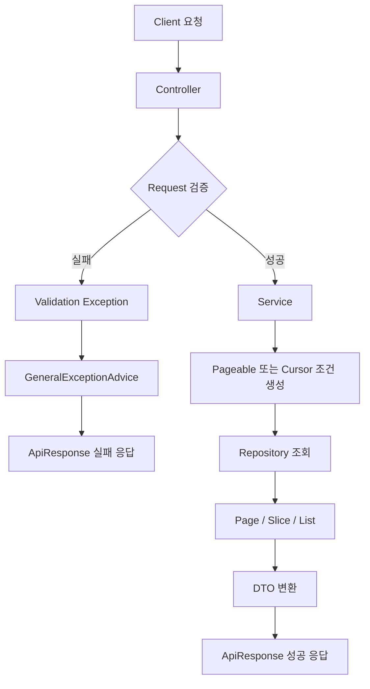

# 1. Page, Slice, Pageable

## 한 줄 정의

`Page`와 `Slice`는 Spring Data에서 페이지네이션 결과를 표현하는 타입이다.

```text
Page  = 현재 페이지 데이터 + 전체 개수 정보
Slice = 현재 조각 데이터 + 다음 데이터 존재 여부
```

`Pageable`은 페이지 요청 정보를 담는 인터페이스이고, 보통 `PageRequest`로 만든다.

```java
Pageable pageable = PageRequest.of(
        pageNumber,
        pageSize,
        Sort.by(Sort.Direction.DESC, "id")
);
```

---

## 왜 필요한가

목록 데이터를 한 번에 모두 내려주면 DB 조회량, 네트워크 응답 크기, 프론트 렌더링 비용이 커진다.

```text
리뷰 200개를 한 번에 응답
→ 사용자가 보지 않는 데이터까지 전송
→ 응답 느려짐
→ 화면 렌더링 부담 증가
```

그래서 목록 API는 보통 일정 크기로 끊어 내려준다.

```text
처음 10개 조회
다음 10개 조회
다시 다음 10개 조회
```

페이징이 들어간 조회 API는 단순히 데이터를 가져오는 코드가 아니라, 요청 검증부터 DTO 변환까지 한 흐름으로 이어진다.



---

## 어떻게 쓰나

Repository 메서드에 `Pageable`을 넘기면 된다.

```java
public interface MissionRepository extends JpaRepository<Mission, Long> {

    Page<Mission> findByStoreId(Long storeId, Pageable pageable);

    Slice<Mission> findSliceByStoreId(Long storeId, Pageable pageable);
}
```

Service에서는 `PageRequest`를 만든다.

```java
Pageable pageable = PageRequest.of(
        pageNumber,
        pageSize,
        Sort.by(Sort.Direction.DESC, "id")
);

Page<Mission> missionPage = missionRepository.findByStoreId(storeId, pageable);
```

SQL 관점에서는 대략 다음과 비슷하다.

```sql
select *
from mission
where store_id = ?
order by id desc
limit 10 offset 0;
```

---

## Pageable, PageRequest, Sort

세 개념은 역할이 조금씩 다르다.

| 개념 | 역할 |
|---|---|
| `Pageable` | 페이지 번호, 크기, 정렬 정보를 담는 인터페이스 |
| `PageRequest` | `Pageable`의 대표 구현체 |
| `Sort` | 정렬 기준과 방향을 표현 |

실사용에서 중요한 것은 **정렬 기준을 명확히 두는 것**이다.

```text
정렬 없는 페이지네이션
→ DB가 어떤 순서로 줄지 명확하지 않음

id desc
→ 최신 데이터 먼저 조회

createdAt desc, id desc
→ 생성일이 같은 경우까지 안정적으로 정렬
```

페이지네이션은 `pageNumber`, `pageSize`만 정하는 것이 아니라 **정렬 기준까지 함께 정하는 작업**이다.

---

## Page와 Slice 비교

| 구분 | Page | Slice |
|---|---|---|
| 현재 페이지 데이터 | O | O |
| 전체 데이터 개수 | O | X |
| 전체 페이지 수 | O | X |
| 다음 페이지 여부 | O | O |
| count 쿼리 | 보통 발생 | 보통 불필요 |
| 어울리는 화면 | 관리자 페이지, 검색 결과 | 더보기, 무한 스크롤 |

정리하면 다음과 같다.

```text
전체 개수와 페이지 번호가 필요하다
→ Page

다음 데이터가 있는지만 알면 된다
→ Slice
```

---

## 실사용 팁

화면 형태를 먼저 보고 선택하면 좋다.

```text
관리자 테이블 / 검색 결과
→ Page 기반 오프셋 페이지네이션

모바일 피드 / 리뷰 목록 / 알림 목록
→ Slice 또는 커서 기반 페이지네이션

응답 스펙이 중요한 API
→ Page/Slice 직접 노출 대신 커스텀 DTO 사용
```

`Page` 객체를 그대로 응답으로 내려줄 수도 있지만, 필요하지 않은 내부 정보가 섞일 수 있다.

그래서 보통은 커스텀 응답 DTO를 만든다.

```java
public record MissionPageResponse(
        List<MissionInfo> missions,
        int pageNumber,
        int pageSize,
        long totalElements,
        int totalPages,
        boolean isFirst,
        boolean isLast
) {
}
```

---

## 공부하면서 얻어갈 점

> **Page와 Slice는 우열이 아니라 화면 요구사항으로 고르는 도구다.**  
> [Spring Data Commons 문서](https://docs.spring.io/spring-data/commons/reference/repositories/query-return-types-reference.html)를 보면 `Page`는 전체 개수와 전체 페이지 수까지 포함하고, `Slice`는 다음 조각이 있는지에 집중한다. 그래서 관리자 목록처럼 전체 개수가 필요한 화면은 `Page`, 모바일 더보기처럼 다음 데이터 여부만 중요한 화면은 `Slice`나 커스텀 페이징 응답이 더 자연스럽다고 이해하면 좋다.

> **요즘은 Page 객체를 그대로 노출하기보다 응답 DTO로 한 번 감싸는 편이 더 안정적이다.**  
> `Page`는 Spring Data가 제공하는 편리한 타입이지만, API 응답으로 그대로 내리면 내부 필드 구조가 클라이언트 계약이 되어버릴 수 있다. 그래서 프로젝트에서는 `pageNumber`, `pageSize`, `totalElements`, `isFirst`, `isLast`처럼 화면에 필요한 값만 골라 DTO로 내려주는 방향을 잡았다.

> **자료를 볼 때는 "Page/Slice의 기능"보다 "어떤 화면에 맞는가"를 중심으로 보면 좋다.**  
> 공식 문서에서 반환 타입 차이를 확인하고, 실제 구현에서는 화면이 페이지 번호를 요구하는지, 무한 스크롤을 요구하는지, 전체 개수가 필요한지를 먼저 질문하면 선택이 쉬워진다.

---

## Offset Pagination과 Cursor Pagination

### 한 줄 정의

오프셋 기반은 “몇 페이지인가”를 기준으로 조회하고, 커서 기반은 “어디부터 이어서 가져올 것인가”를 기준으로 조회한다.

```text
Offset Pagination
→ pageNumber, pageSize

Cursor Pagination
→ cursor, size
```

---

### 왜 필요한가

같은 페이지네이션이어도 화면과 데이터 규모에 따라 적합한 방식이 다르다.

오프셋 기반은 페이지 번호 UI에 좋다.

```http
GET /missions?pageNumber=0&pageSize=10
GET /missions?pageNumber=1&pageSize=10
```

커서 기반은 무한 스크롤이나 더보기 UI에 좋다.

```http
GET /reviews?size=10
GET /reviews?cursor=100&size=10
```

---

### 오프셋 기반 페이지네이션

SQL 관점에서는 `limit`와 `offset`을 사용한다.

```sql
select *
from mission
order by id desc
limit 10 offset 20;
```

장점:

```text
페이지 번호 UI 만들기 쉬움
전체 페이지 수와 잘 어울림
구현이 직관적
```

주의할 점:

```text
뒤쪽 페이지로 갈수록 느려질 수 있음
중간에 데이터가 추가/삭제되면 중복이나 누락 가능
```

---

### 커서 기반 페이지네이션

ID 기준 커서라면 다음처럼 조회한다.

```sql
select *
from review
where review_id < :cursor
order by review_id desc
limit :size;
```

첫 요청에는 cursor가 없을 수 있다.

```sql
select *
from review
order by review_id desc
limit :size;
```

응답에서는 다음 요청에 사용할 커서를 내려준다.

```json
{
  "reviews": [],
  "nextCursor": "91",
  "hasNext": true
}
```

---

### 커서 설계에서 중요한 점

커서는 정렬 기준과 함께 설계해야 한다.

ID 정렬은 ID가 유니크하므로 cursor 하나로 충분할 수 있다.

```sql
where review_id < :cursor
order by review_id desc
```

하지만 별점은 중복될 수 있다.

```text
5.0점 리뷰 A
5.0점 리뷰 B
5.0점 리뷰 C
```

이때 별점만 cursor로 쓰면 중복이나 누락이 생길 수 있다.  
그래서 별점과 ID를 함께 사용한다.

```sql
where rating < :rating
   or (rating = :rating and review_id < :reviewId)
order by rating desc, review_id desc
limit :size;
```

커서는 다음처럼 만들 수 있다.

```text
rating:reviewId
4.5:120
```

---

### 실사용 팁

선택 기준은 이렇게 잡으면 쉽다.

```text
페이지 번호가 중요하다
→ Offset + Page

무한 스크롤이 중요하다
→ Cursor + hasNext

전체 개수가 꼭 필요하다
→ Page

전체 개수보다 다음 데이터 여부가 중요하다
→ Slice 또는 size + 1 조회
```

---

### 공부하면서 얻어갈 점

> **커서 기반 페이지네이션은 단순히 `cursor` 파라미터 하나를 추가하는 일이 아니다.**  
> [GitHub GraphQL Pagination 문서](https://docs.github.com/graphql/guides/using-pagination-in-the-graphql-api)를 보면 `endCursor`, `hasNextPage`를 함께 내려준다. 여기서 커서는 다음 조회를 이어가기 위한 "정렬 기준의 위치값"에 가깝다. 그래서 `id desc`인지, `rating desc + id desc`인지처럼 정렬 기준을 먼저 고정해야 커서도 안정적으로 설계할 수 있다.

> **해외 커뮤니티에서 커서 기반 페이지네이션 질문이 계속 나오는 이유는 처음 감각이 직관적이지 않기 때문이다.**  
> 페이지 번호는 `1페이지`, `2페이지`처럼 사람이 이해하기 쉽지만, 커서는 서버가 정렬 기준을 바탕으로 다음 조회 위치를 계산한다. [Reddit의 cursor pagination 질문](https://www.reddit.com/r/shopifyDev/comments/1r9blbx/struggling_to_understand_cursorbased_pagination/)처럼 처음에는 `cursor`가 무엇을 의미하는지 헷갈리기 쉽다. 이때 "마지막으로 본 데이터의 정렬 위치"라고 이해하면 훨씬 편하다.

> **이번 미션에서는 두 방식을 모두 써본 것이 학습 포인트다.**  
> 진행중 미션 조회는 워크북 흐름에 맞춰 `Page` 기반 오프셋 페이징으로 구현했고, 내가 작성한 리뷰 목록은 커서 기반으로 구현했다. 덕분에 `Page`가 주는 전체 개수 정보와, 커서 방식의 `hasNext`, `nextCursor` 감각을 비교할 수 있었다.

---

# 2. Java Stream API

## 한 줄 정의

Stream API는 컬렉션 데이터를 선언형으로 변환, 필터링, 집계하기 위한 도구이다.

이번 워크북에서는 주로 **Entity 목록을 Response DTO 목록으로 변환**할 때 사용한다.

```text
List<Entity>
→ stream()
→ map()
→ toList()
```

---

## 왜 필요한가

Repository에서 조회한 결과는 보통 Entity다.

```java
List<Mission> missions = missionRepository.findAll();
```

하지만 API 응답으로 Entity를 그대로 내려주지는 않는다.

```text
Mission Entity
→ MissionResponse DTO
```

Stream을 사용하면 이 변환 의도가 잘 보인다.

```java
List<MissionResponse> responses = missions.stream()
        .map(MissionConverter::toMissionResponse)
        .toList();
```

핵심은 “반복한다”가 아니라 **Mission을 MissionResponse로 매핑한다**는 점이다.

---

## filter, map, toList

이번 주차에서 가장 중요한 것은 `map`이다.

| 메서드 | 역할 |
|---|---|
| `filter` | 조건에 맞는 데이터만 남김 |
| `map` | 데이터 형태를 변환 |
| `toList` | Stream 결과를 List로 수집 |

예시:

```java
List<MissionResponse> responses = missions.stream()
        .filter(Mission::isActive)
        .map(MissionConverter::toMissionResponse)
        .toList();
```

`stream().toList()`는 Java 16부터 사용할 수 있고, 반환 리스트는 변경 불가능하다.  
변환 후 요소를 추가해야 한다면 명시적으로 새 리스트를 만들면 된다.

```java
List<MissionResponse> responses = new ArrayList<>(
        missions.stream()
                .map(MissionConverter::toMissionResponse)
                .toList()
);
```

---

## Page와 Stream

`Page`는 content 변환용 `map`을 제공한다.

```java
Page<MissionResponse> responsePage =
        missionPage.map(MissionConverter::toMissionResponse);
```

이 방식은 페이지 메타데이터는 유지하고 content 타입만 바꿀 수 있다.

```text
Page<Mission>
→ Page<MissionResponse>
```

---

## 주의할 점

Stream은 조회 최적화 도구가 아니다.

```text
Stream
→ 조회된 데이터를 가공하는 도구

성능
→ Repository 쿼리 설계, fetch 전략, 인덱스 설계가 더 중요
```

예를 들어 다음 코드는 깔끔해 보인다.

```java
missions.stream()
        .map(mission -> mission.getStore().getName())
        .toList();
```

하지만 `store`가 LAZY이고 미리 조회되지 않았다면 N+1이 생길 수 있다.

```text
Mission 목록 조회 1번
+ 각 Mission의 Store 조회 N번
```

따라서 Stream보다 먼저 확인할 질문은 이것이다.

```text
DTO 변환에 필요한 연관 객체가 이미 조회되어 있는가?
```

---

## 실사용 팁

Stream 안에는 단순 변환만 두는 편이 좋다.

```text
좋은 사용
→ Entity를 DTO로 변환

주의할 사용
→ Stream 안에서 Entity 상태 변경
→ Stream 안에서 외부 서비스 호출
→ Stream 안에서 복잡한 비즈니스 로직 처리
```

복잡한 조건이 많아지면 Stream보다 for문이 더 읽기 쉬울 수도 있다.

---

## 공부하면서 얻어갈 점

> **Stream은 DB 조회를 빠르게 만드는 도구가 아니라, 조회된 데이터를 읽기 좋게 변환하는 도구다.**  
> [Java Stream API 문서](https://docs.oracle.com/en/java/javase/17/docs/api/java.base/java/util/stream/Stream.html)를 보면 Stream은 컬렉션 데이터를 `filter`, `map`, `reduce` 같은 연산으로 처리하는 추상화다. 이번 미션에서는 특히 `map()`을 통해 Entity 목록을 DTO 목록으로 바꾸는 데 집중하면 된다.

> **Stream을 쓰면 코드가 짧아지지만, 책임이 섞이면 오히려 읽기 어려워진다.**  
> `stream().map(converter::toDto).toList()`처럼 단순 변환은 깔끔하다. 반대로 Stream 안에서 DB 조회, 외부 API 호출, Entity 상태 변경이 섞이면 디버깅이 어려워진다. 그래서 Stream은 "이미 조회된 데이터를 응답 형태로 바꾸는 구간"에 두는 것이 가장 안전하다.

> **해외 자료를 볼 때는 병렬 Stream보다 기본 Stream의 의도를 먼저 보는 편이 좋다.**  
> 초반 학습에서는 `parallelStream()`보다 `map`, `filter`, `toList`의 흐름을 익히는 게 중요하다. 실제 웹 애플리케이션에서는 병렬 처리보다 트랜잭션, 영속성 컨텍스트, 쿼리 수가 더 큰 영향을 주는 경우가 많다.

---

# 3. 객체 그래프 탐색

## 한 줄 정의

객체 그래프 탐색은 한 Entity에서 연관된 다른 Entity로 객체 참조를 따라 이동하는 것이다.

```java
memberMission.getMission().getStore().getName()
```

이 코드는 `MemberMission → Mission → Store`로 이동해서 가게 이름을 읽는다.

---

## 왜 필요한가

RDB에서는 테이블 간 관계를 join으로 탐색한다.

```sql
select s.name
from member_mission mm
join mission m on mm.mission_id = m.mission_id
join store s on m.store_id = s.store_id
where mm.member_id = ?;
```

JPA에서는 객체 참조를 따라 탐색할 수 있다.

```java
String storeName = memberMission.getMission().getStore().getName();
```

객체처럼 읽을 수 있다는 점이 JPA의 장점이다.

---

## 어떻게 쓰나

DTO 변환 과정에서 자주 사용된다.

```java
MemberMissionResponse response = new MemberMissionResponse(
        memberMission.getId(),
        memberMission.getMission().getId(),
        memberMission.getMission().getStore().getName(),
        memberMission.getStatus()
);
```

하지만 목록 조회에서는 다음을 확인해야 한다.

```text
memberMission은 영속 상태인가?
mission은 이미 조회되어 있는가?
store는 이미 조회되어 있는가?
반복문 안에서 탐색이 수행되는가?
```

---

## LAZY와 N+1

연관관계가 LAZY라면 처음에는 실제 객체가 아니라 프록시가 들어있을 수 있다.

```java
@ManyToOne(fetch = FetchType.LAZY)
private Mission mission;
```

프록시의 실제 필드에 접근하는 순간 추가 SELECT가 발생할 수 있다.

문제는 목록에서 반복될 때다.

```java
memberMissions.stream()
        .map(mm -> mm.getMission().getStore().getName())
        .toList();
```

필요한 연관 객체가 미리 조회되지 않았다면 다음처럼 쿼리가 늘 수 있다.

```text
MemberMission 목록 조회 1번
+ Mission 조회 N번
+ Store 조회 N번
```

이를 N+1 문제라고 한다.

---

## 해결 키워드

객체 그래프 탐색을 안전하게 쓰려면 필요한 연관 데이터를 미리 가져오거나, 처음부터 DTO로 조회할 수 있다.

### Fetch Join

```java
@Query("""
    select mm
    from MemberMission mm
    join fetch mm.mission m
    join fetch m.store s
    where mm.member.id = :memberId
""")
List<MemberMission> findWithMissionAndStore(Long memberId);
```

### EntityGraph

```java
@EntityGraph(attributePaths = {"mission", "mission.store"})
List<MemberMission> findByMemberId(Long memberId);
```

### DTO Projection

```java
@Query("""
    select new com.example.MemberMissionResponse(
        mm.id,
        m.id,
        s.name,
        mm.status
    )
    from MemberMission mm
    join mm.mission m
    join m.store s
    where mm.member.id = :memberId
""")
Page<MemberMissionResponse> findMissionResponses(Long memberId, Pageable pageable);
```

---

## 실사용 팁

기준은 다음처럼 잡을 수 있다.

```text
도메인 로직 처리
→ Entity 그래프 탐색 활용

목록 화면 응답
→ 필요한 연관 데이터를 fetch join / EntityGraph / DTO Projection으로 명시

API 응답
→ Entity 직접 반환 금지, DTO로 끊기
```

객체 그래프 탐색은 “마음껏 접근해도 된다”가 아니라, **객체 관계를 따라 읽을 수 있지만 그 뒤에서 SQL이 발생할 수 있다**는 뜻으로 이해해야 한다.

---

## 공부하면서 얻어갈 점

> **객체 그래프 탐색은 JPA를 편하게 쓰게 해주지만, SQL이 사라졌다는 뜻은 아니다.**  
> [Hibernate User Guide의 fetching 관련 내용](https://docs.hibernate.org/orm/6.5/userguide/html_single/Hibernate_User_Guide.html#fetching)을 보면 연관 객체를 언제, 어떻게 가져올지가 성능에 큰 영향을 준다. `memberMission.getMission().getStore().getName()`은 Java 코드로는 자연스럽지만, 연관관계가 `LAZY`라면 필요한 순간 추가 SQL이 실행될 수 있다.

> **목록 API에서는 "응답에 필요한 연관 데이터"를 먼저 확인해야 한다.**  
> 단건 조회에서는 객체 그래프 탐색이 편하지만, 목록 조회에서 반복적으로 연관 객체를 접근하면 N+1 문제가 생길 수 있다. 그래서 목록 화면은 fetch join, EntityGraph, DTO projection, 명시적 repository query 중 하나를 선택해 조회 의도를 드러내는 편이 좋다.

> **오픈소스 Spring 프로젝트를 볼 때는 Entity를 그대로 반환하지 않는 흐름을 보면 좋다.**  
> [Spring PetClinic](https://github.com/spring-projects/spring-petclinic) 같은 예제 프로젝트는 Spring 계층 구조와 검증, 조회 흐름을 보기 좋다. 여기서 얻어갈 점은 "JPA Entity는 DB와 도메인 모델을 표현하고, API 응답은 DTO로 끊는다"는 감각이다.

---

# 4. @Valid와 @Validated

## 한 줄 정의

`@Valid`와 `@Validated`는 요청 데이터가 정해진 조건을 만족하는지 검증하기 위해 사용하는 어노테이션이다.

```text
@Valid
→ Jakarta Bean Validation 표준 검증 트리거

@Validated
→ Spring이 제공하는 검증 확장 기능
```

---

## 왜 필요한가

클라이언트 요청은 항상 올바르다고 가정할 수 없다.

```json
{
  "deadline": null,
  "point": -100,
  "conditional": ""
}
```

이런 값을 서비스 로직에서 뒤늦게 처리하면 500 에러가 나거나, 클라이언트가 무엇을 잘못 보냈는지 알기 어렵다.

그래서 Controller 진입 시점에서 Request DTO를 먼저 검증한다.

```text
Client 요청
→ Controller에서 @Valid 검증
→ 실패 시 Validation Exception
→ GeneralExceptionAdvice
→ ApiResponse 실패 응답
---

## validation 의존성

검증 어노테이션을 사용하려면 Bean Validation 의존성이 필요하다.

Spring Boot 3 계열에서는 보통 다음 의존성을 추가한다.

```gradle
implementation 'org.springframework.boot:spring-boot-starter-validation'
```

그리고 Spring Boot 3에서는 `javax.validation.*`이 아니라 `jakarta.validation.*` 패키지를 사용한다.

```java
import jakarta.validation.Valid;
import jakarta.validation.constraints.NotBlank;
import jakarta.validation.constraints.NotNull;
```

---

## 어떻게 쓰나

Request DTO에 검증 어노테이션을 붙인다.

```java
public record MissionCreateRequest(
        @NotNull(message = "마감일은 필수입니다.")
        @Future(message = "마감일은 현재보다 미래여야 합니다.")
        LocalDate deadline,

        @NotNull(message = "포인트는 필수입니다.")
        @Min(value = 1, message = "포인트는 1 이상이어야 합니다.")
        Integer point,

        @NotBlank(message = "미션 조건은 필수입니다.")
        @Size(max = 255, message = "미션 조건은 최대 255자까지 입력할 수 있습니다.")
        String conditional
) {
}
```

Controller 파라미터에 `@Valid`를 붙여야 검증이 실행된다.

```java
@PostMapping("/missions")
public ApiResponse<Void> createMission(
        @Valid @RequestBody MissionCreateRequest request
) {
    missionService.createMission(request);
    return ApiResponse.onSuccess(...);
}
```

검증 실패는 전역 예외 처리에서 잡아 응답을 통일한다.

```java
@ExceptionHandler(MethodArgumentNotValidException.class)
public ResponseEntity<ApiResponse<Map<String, String>>> handleValidationException(
        MethodArgumentNotValidException e
) {
    Map<String, String> errors = new HashMap<>();

    e.getBindingResult().getFieldErrors().forEach(error -> {
        errors.put(error.getField(), error.getDefaultMessage());
    });

    return ResponseEntity.badRequest()
            .body(ApiResponse.onFailure(GeneralErrorCode.BAD_REQUEST, errors));
}
```

---

## 자주 쓰는 검증 어노테이션

| 어노테이션 | 대상 | 의미 |
|---|---|---|
| `@NotNull` | 모든 참조 타입 | null 불가 |
| `@NotBlank` | String | null, 빈 문자열, 공백 불가 |
| `@NotEmpty` | String, Collection | null 또는 empty 불가 |
| `@Size` | String, Collection | 길이 또는 크기 제한 |
| `@Min` / `@Max` | 숫자 | 최소/최대값 제한 |
| `@Positive` | 숫자 | 양수 |
| `@Future` | 날짜 | 미래 날짜 |
| `@Past` | 날짜 | 과거 날짜 |
| `@Pattern` | String | 정규식 패턴 검증 |
| `@Email` | String | 이메일 형식 검증 |

문자열 필수 입력에는 보통 `@NotBlank`가 적합하다.

```text
@NotNull
→ null만 막음

@NotEmpty
→ null과 빈 값 막음

@NotBlank
→ null, 빈 문자열, 공백 문자열까지 막음
```

---

## @Valid와 @Validated 비교

| 구분 | @Valid | @Validated |
|---|---|---|
| 소속 | Jakarta Bean Validation 표준 | Spring 제공 |
| 주 용도 | Request Body DTO 검증 | DTO 검증 + 그룹 검증 + 메서드 파라미터 검증 |
| 그룹 검증 | 직접 지원하지 않음 | 지원 |
| 자주 쓰는 위치 | `@RequestBody` 앞 | Controller 클래스, 그룹 검증 대상 |

일반적인 기준은 다음과 같다.

```text
Request Body DTO 단순 검증
→ @Valid

검증 그룹이 필요하다
→ @Validated

@RequestParam, @PathVariable 검증
→ Controller 클래스에 @Validated 고려
```

---

## Request Body 검증과 Query Parameter 검증

Request Body DTO 검증 실패는 보통 `MethodArgumentNotValidException`으로 처리한다.

```text
@Valid @RequestBody
→ DTO 필드 검증 실패
→ MethodArgumentNotValidException
```

하지만 `@RequestParam`, `@PathVariable` 검증은 다른 예외 흐름을 탈 수 있다.

```text
필수 Query Parameter 누락
→ MissingServletRequestParameterException

타입 변환 실패
→ MethodArgumentTypeMismatchException

@Min, @Positive 같은 제약조건 실패
→ Spring 버전에 따라 ConstraintViolationException 또는 HandlerMethodValidationException 계열
```

이번 워크북은 Request Body 검증이 핵심이므로 `MethodArgumentNotValidException`을 먼저 처리하면 충분하다.  
이후 Query Parameter 검증까지 넓히면 전역 예외 처리 범위를 한 단계 더 확장하는 학습이 된다.

---

## 실사용 팁

검증은 한 곳에서 모든 것을 막으려 하기보다 층을 나누면 좋다.

```text
Controller DTO 검증
→ 요청 형식, 필수값, 길이, 범위 검증

Service 도메인 검증
→ 권한, 상태 전이, 중복 여부, 소유자 검증

DB 제약조건
→ unique, not null, foreign key 등 최종 데이터 무결성 보장
```

`@Valid`는 요청 형식을 검증하는 도구이지, 모든 비즈니스 규칙을 대체하지 않는다.

---

## 공부하면서 얻어갈 점

> **검증은 Controller에서 끝나는 일이 아니라 실패 응답까지 포함한 API 설계다.**  
> [Spring MVC Validation 문서](https://docs.spring.io/spring-framework/reference/web/webmvc/mvc-controller/ann-validation.html)를 보면 Request Body 검증 실패와 메서드 파라미터 검증 실패는 다른 예외 흐름으로 처리될 수 있다. 이번 워크북에서는 `@Valid @RequestBody`와 `MethodArgumentNotValidException`을 먼저 잡았고, 이후 Query Parameter 검증까지 넓히면 `HandlerMethodValidationException` 같은 흐름도 함께 공부할 수 있다.

> **Spring Boot 3 이후에는 `javax.validation`보다 `jakarta.validation`을 보는 습관이 필요하다.**  
> [Hibernate Validator Reference Guide](https://docs.hibernate.org/validator/8.0/reference/en-US/html_single/)는 Jakarta Bean Validation 기반 설명을 제공한다. 예전 블로그 글에는 `javax.validation.Valid`가 많이 나오지만, 현재 Spring Boot 3 계열에서는 `jakarta.validation.Valid`를 사용하는 것이 자연스럽다.

> **`@Valid`는 요청 형식 검증, Service 검증은 비즈니스 규칙 검증으로 나누면 이해가 쉽다.**  
> `memberId`가 null인지, 문자열 길이가 맞는지, 별점 범위가 맞는지는 DTO 검증에서 처리한다. 반면 이미 리뷰를 작성한 회원 미션인지, 완료된 미션인지, 본인의 미션인지 같은 규칙은 Service나 도메인 로직에서 검증하는 것이 좋다.
