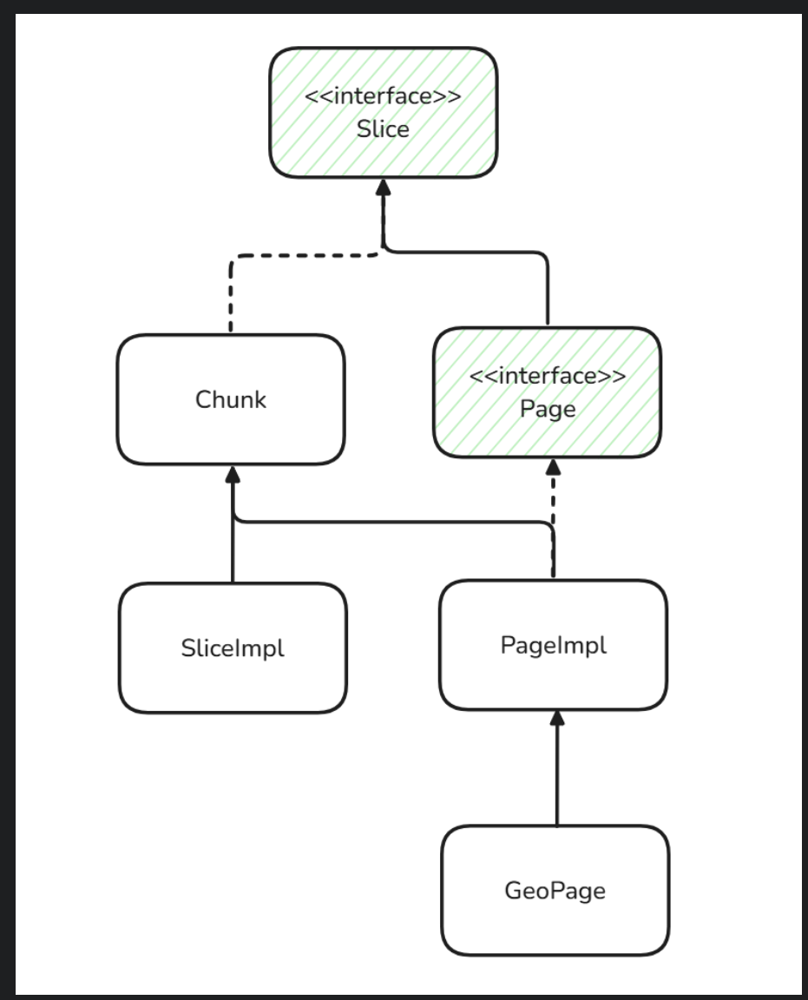
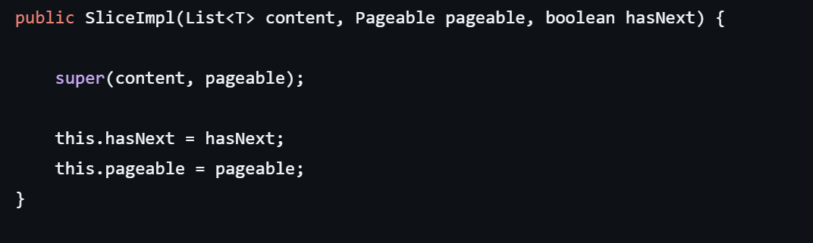
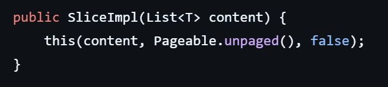
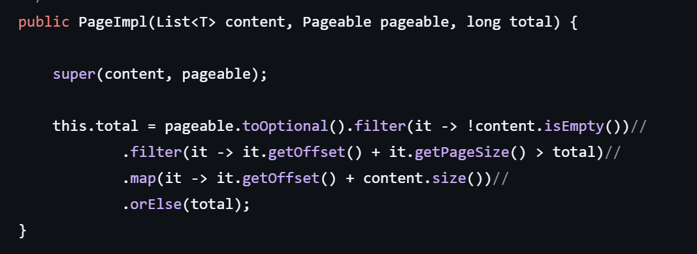
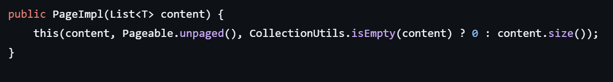

- Page와 Slice

  Pageable은 페이징 요청 정보를 담는 인터페이스이다.

  → 결국, 페이징을 진행할 데이터의 원본은 데이터베이스에 있다.

  JPA는 Pageable 정보를 기반으로 DB에 쿼리를 날리고, 결과를 다시 특정 객체로 반환해준다.

  이때 결과를 담아주는 객체가 **Page**와 **Slice**이다.

    - 객체 상속 관계

      

    - Slice
        - 다음 페이지가 있는지만 알려주는 가벼운 페이징 결과 객체
        - **SliceImpl**구현 클래스를 통해 객체를 생성하고 동작을 수행한다.
        - 생성 방식
            - **List<T>content + pageable + hasNext**

              

                ```java
                 // 현재 페이지의 데이터
                List<String> content = Arrays.asList("item1", "item2", "item3");
                
                // Pageable 정보 (0번 페이지, 3개씩 조회)
                Pageable pageable = PageRequest.of(0, 3);
                
                // 다음 페이지가 있다고 가정
                boolean hasNext = true;
                
                // SliceImpl 생성
                Slice<String> slice = new SliceImpl<>(content, pageable, hasNext);
                ```

                - hasNext  값을 인자로 받는다.
                - 전체 데이터 개수를 알기 위한 별도의 count(*) 쿼리가 필요하지 않다.
                - **전체 페이지 수를 알 필요 없는 무한 스크롤과 같은 경우는 Slice를 사용하는 것이 적합하다.**
                    - 전체 페이지를 모르는데 hasNext()를 판별할 수 있는 이유

                      기존의 페이지 사이즈보다 한 개를 더해서 불러온다면
                      다음 페이지에 데이터가 있는지에 대한 여부를 확인 가능하다.

                      ⇒JPA에서는 쿼리를 보낼 때 PageRequest가 요구하는
                      페이지 사이즈에 +1을 하여 쿼리를 조회한다. 
          
            - -**List<T>content**

              

              - pageable이 필요 없는 경우에 사용한다.
              - hasNext를 false로 이용한다.

                  ```java
                  this(content, Pageable.unpaged(), false);
                    
                  ```

    - Page
        - Slice의 모든 기능 + 전체 페이지 수, 총 데이터 개수 제공
        - **PageImpl** 구현 클래스를 통해 객체를 생성하고 동작을 수행한다.
            - hasNext(): 다음 페이지가 있는지에 대한 여부
            - isLast(): 현재 페이지가 마지막인지에 대한 여부
            - getTotalPages(), getTotalElements(): 전체 데이터 개수에 대한 정보
        - 생성 방식
            - **List<T>content + pageable + total**

                

                ```java
                // 현재 페이지의 데이터
                List<String> content = Arrays.asList("item1", "item2", "item3");
                
                // Pageable 정보 (0번 페이지, 3개씩 조회)
                Pageable pageable = PageRequest.of(0, 3);
                
                // 전체 데이터 개수가 100개
                long total = 100
                
                // Page 생성
                Page<String> page = new PageImple<>(content, pageable, total);
                ```

                - 전체 데이터 개수를 알아야 하기 때문에,
                  Spring Data JPA는 내부적으로 count(*) 쿼리를 별도로 실행하여
                  전체 데이터 수를 조회한다.
              
            - **List<T>content**
          
              - 
                  ```java
                  List<String> content = userRepository.findAll() // 전체 데이터
                  Page<User> page = new PageImpl<>(content);      // 전체를 Page로 감싸기
                  ```

                  - 페이지 정보 없이 단순히 리스트만 주어진 경우에 사용하는 간단한 생성자
                  - 총 개수는 content.size() 로 대체한다.

        - 상황별 사용


            | 반환타입 | 설명 | 적합한 상황 |
            | --- | --- | --- |
            | Page<T> | 전체 개수(count(*))와 전체 페이지 수를 함께 제공 | 페이지 번호와 전체 페이지 수 표시가 필요한 페이징 (예: 게시판) |
            | Slice<T> | 다음 페이지 유무만 판단 (count(*)는 실행하지 않음) | 무한 스크롤, 성능이 중요한 경우(ex. 모바일 피드) |
        - 단점
            - Slice는 오프셋이 큰 경우에 DB 성능이 저하될 가능성이 있다.’
            - Page는 COUNT 쿼리 비용이 클 수 있다.


- Java stream API

  Stream API:
  람다식을 이용한 기술 중에 하나로 데이터 소스를 조작 및 가공, 변환하여
  원하는 값으로 반환해주는 인터페이스이다.

  java.util.stream에 있다.

  배열의 각 요소를 개발자가 직접 컬렉션 외부로 꺼내올 필요 없이,
  컬렉션 내부에서 어떻게 처리할지만 기술하면 된다.
  이러한 특성으로 인해 Streams API는 내부 반복자라고 부른다.

    - 람다식이란?

      익명 함수라고도 한다.

      함수를 하나의 식으로 표현한 인터페이스이다. 메소드의 이름이 없다.


- 특징
        - Stream은 원본 데이터를 변경하지 않는다.
        - 재사용이 불가능하여서 일회용으로 사용된다.
        - 내부 반복으로 작업을 처리한다.
        
    - 과정
        - Stream 생성 → 중간 연산 → 최종 연산
        - 객체.Stream생성().중간연산.최종연산 ⇒ 이런 식으로 작성
        
      - 중간 연산 종류 
      - 
            | Stream 필터 | filter(), distinct() |
            | --- | --- |
            | Stream 변환 | map(), flatMap() |
            | Stream 제한 | limit(), skip() |
            | Stream 정렬 | sorted() |
            | Stream 연산 결과 확인 | peek() |

    - 최종 연산 종류
    -
          | 요소의 출력 | forEach() |
          | --- | --- |
          | 요소의 검색 | findFirst(), findAny() |
          | 요소의 검사 | anyMatch(), allMatch(), noneMatch() |
          | 요소의 통계 | count(), min(), max() |
          | 요소의 연산 | sum(), average() |
          | 요소의 수집 | collect() |
    - 사용예시
        - 대량 데이터를 한 번만 반복 처리할 때는 parallelStream이 유리
        - 작은 데이터에서는 for문이 빠르다.
        
        ```java
        void mapping_and_sorting(){  
            List<String> names = Arrays.asList("John", "Jane", "Tom", "Jerry");  
        
            List<String> sortedNames = names.stream()  
                    .map(String::toUpperCase) // 중간 연산: 대문자로 변환  
                    .sorted() // 중간 연산: 알파벳 순으로 정렬  
                    .toList();  
        
            assertEquals("JANE", sortedNames.get(0));  
            assertEquals("JERRY", sortedNames.get(1));  
            assertEquals("JOHN", sortedNames.get(2));  
            assertEquals("TOM", sortedNames.get(3));  
        }
        ```
        
    - 장단점
        - 최종 연산을 누락하는 경우 그 스트림은 작업을 처리하지 않고 무시된다.
        - 재사용 스트림 문제
            - 다음 코드에서 이미 사용한 스트림을 사용하려고 하면 작동하지 않는다.
        - 무한 스트림 생성
            - iterate() 연산을 사용하면 무한히 생성될 수 있다.
        - 반복문 없이 가독성 높은 코드 작성 가능
        - 병렬 처리 가능
            - parallelStream() 사용하면 중간 연산 병렬 처리 가능

- 객체 그래프 탐색

  객체는 상속, 연관 관계만 맺어져 있다면 자유롭게 그래프를 탐색 가능해야 한다.

  JPA는 지연로딩을 통해 객체를 사용하는 시점까지 DB 작업을 미룬다.

    - 장단점
        - SQL 직접 작성과 다르게 조인의 제약에서 벗어나
          논리적인 도메인 모델 구조에 따라 데이터를 조회 가능
        - 객체 그래프를 무분별하게 탐색할 경우, 하이버네이트 등에서 N+1 문제 발생 가능
    - SQL과 차이
        - DB는 지정된 테이블만 조회가 가능, 모든 객체 그래프를 탐색하기 어렵다.
        - 자유로운 탐색이 가능하다.

          - @Valid vs @Validated

            둘 다 유효성 검증을 위한 어노테이션이다.

              - @Valid
                  - Bean Validator를 통해 객체의 데이터 유효성 검증을 지시하는 어노테이션
                    - 구현체가 따로 없다 ⇒ Hibernate Validator 사용
                        - 동작 과정
                            - 요청이 들어오면 Dispatcher Servlet에서
                              요청에 맞는 컨트롤러에 요청을 전달합니다.
                            - 전달 과정에서 컨트롤러 메소드의 객체를 전달해주는 HandlerMethodArgumentResolver 동작
                              @Valid 역시 HandlerMethodArgumentResolver 의해 처리가 됩니다.

                                **ArgumentResolver : @RequestBody가 붙은 데이터를 Json 포멧으로 변경**
                    
                            - @**Valid**로 시작하는 어노테이션이 붙어있으면 
                            dispathcher servlet 단에서 검사를 진행하는 식으로 동작
                    
                              **⇒ 주로 Request Body에서 검증하는데 많이 사용된다.**
                    
                        - Spring에서 @Valid는 기본적으로 Controller에서만 동작하도록 설계되어 있다
                        **다른 계층에서 검증하기 위해서는 @Validated와 결합**하여 사용합니다.
            
                  - 장단점
                      - 자바 표준
                      - 컨트롤러에서만 사용 가능
    
              - @Validation
                  - Controller 뿐만 아니라 다른 계층에서도 데이터 유효성 검증을 해야하는 경우 
                  메소드 요청을 가로채서 유효성 검증을 해주는 **Spring AOP 기반 기능**
                  - 유효성 검증이 필요한 클래스에 @Validated를 붙이고, 
                  유효성 검증을 할 파라미터에 @Valid를 붙이면 동작하게 됩니다.
            
                      ```java
                      @Service
                      @Validated
                      public class Service {
            
                          public void doSomething(@Valid Request request) {
                              ...
                          }
                      }
                      ```
            
                  - Spring의 기능이기 때문에 Bean이면 모두 유효성 검증이 가능하다.
                  - MethodValidationInterceptor에 Validator이 의존성 주입으로 들어가므로 
                  @Valid와 똑같이 Hibernate Validator를 사용하기 때문에 
                  Bean Validation을 그대로 이용할 수 있게 됩니다.
        
                  - 동작 과정
                      - @Validated를 클래스에 선언하면 해당 클래스에 유효성 검증을 위한 
                      인터셉터인 MethodValidationInterceptor가 등록됩니다.
                      - 해당 클래스의 메소드가 호출 될 때 AOP가 확인을 하고 
                      요청을 중간에 가로채어 유효성 검증을 진행하게 됩니다.
                  - 장단점
                      - 그룹 검증
                      - 모든 Bean에서 유효성 검증
                      - 스프링 환경에서만 가능


