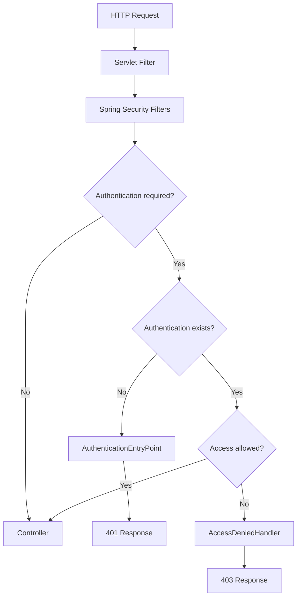

# 1. Spring Security

## 한 줄 정의

**Spring Security는 Spring 애플리케이션에서 인증, 인가, 보안 관련 처리를 담당하는 프레임워크이다.**

가장 중요한 특징은 보안 로직이 Controller 안에서 흩어지는 것이 아니라, **Servlet Filter Chain 앞단에서 공통으로 처리된다**는 점이다.

```text
Client Request
-> Servlet Filter Chain
-> Spring Security Filter Chain
-> DispatcherServlet
-> Controller
```

Spring Security를 처음 공부할 때는 클래스 이름을 모두 외우기보다 다음 역할을 먼저 구분하면 좋다.

| 구성요소 | 역할 |
|---|---|
| `SecurityFilterChain` | 어떤 요청을 허용하고 막을지 정하는 보안 필터 묶음 |
| `Authentication` | 인증 결과를 담는 객체 |
| `AuthenticationManager` | 인증 처리를 적절한 Provider에게 위임 |
| `AuthenticationProvider` | 실제 인증 로직 수행 |
| `UserDetailsService` | DB나 저장소에서 사용자 정보 조회 |
| `SecurityContext` | 현재 요청 또는 세션의 인증 상태 저장 |
| `ExceptionTranslationFilter` | 인증/인가 예외를 401/403 응답으로 변환 |

요청이 들어왔을 때의 큰 흐름은 다음과 같다.



---

## 왜 필요한가

예를 들어 쇼핑몰 서비스에 다음 API가 있다고 하자.

```text
GET /orders/me
POST /orders
GET /admin/orders
```

이 API마다 Controller에서 직접 로그인 여부와 권한을 검사하면 문제가 생긴다.

```java
if (!loginUser.isAuthenticated()) {
    throw new UnauthorizedException();
}
```

이런 방식은 다음 위험이 있다.

```text
- Controller마다 중복 코드가 생긴다.
- 새 API를 만들 때 보안 검사를 빠뜨릴 수 있다.
- 인증 실패, 권한 실패 응답 형식이 API마다 달라질 수 있다.
```

Spring Security는 이런 공통 보안 정책을 Filter Chain에서 먼저 처리하도록 도와준다.

```java
.authorizeHttpRequests(authorize -> authorize
    .requestMatchers("/signup", "/login").permitAll()
    .requestMatchers("/admin/**").hasRole("ADMIN")
    .anyRequest().authenticated()
)
```

---

## 예시로 이해하기

블로그 서비스를 예로 들면 다음처럼 나눌 수 있다.

```text
Public
-> 글 목록 조회
-> 글 상세 조회
-> 회원가입
-> 로그인

Private
-> 내 글 작성
-> 내 글 수정
-> 내 댓글 삭제

Admin
-> 신고된 글 숨김
-> 사용자 정지
```

이 구분은 Controller가 아니라 Security 설정에서 먼저 표현할 수 있다.

```text
누구나 가능한 요청인가?
로그인한 사용자만 가능한 요청인가?
특정 권한이 필요한 요청인가?
```

이 질문이 Spring Security 설정의 출발점이다.

처음에는 URL 단위 인가로 시작할 수 있다.

```text
/login
-> 누구나 접근 가능

/my/**
-> 로그인한 사용자만 접근 가능

/admin/**
-> ADMIN 권한이 있는 사용자만 접근 가능
```

서비스가 커지면 URL 단위 인가만으로 부족해진다.
예를 들어 `GET /posts/10`은 누구나 볼 수 있지만, `PATCH /posts/10`은 작성자만 가능해야 할 수 있다.
이때는 URL만 보는 것이 아니라 리소스의 소유자까지 확인해야 한다.

```text
URL 인가
-> /admin/** 인가

리소스 소유권 인가
-> post.authorId == loginUser.id
```

---

## 공부하면서 얻어갈 점

> **Spring Security를 공부할 때는 "로그인 기능"보다 "요청이 Controller에 도달하기 전에 어떤 필터들을 지나는가"를 먼저 보는 편이 좋다.**  
> [Spring Security Servlet Architecture 문서](https://docs.spring.io/spring-security/reference/servlet/architecture.html)는 Security가 Servlet Filter 기반으로 동작한다는 점을 설명한다. 그래서 인증/인가 실패는 Controller에 도달하기 전에 끝날 수 있고, 이때는 일반적인 Controller 예외 처리와 다른 응답 통로가 필요하다.

> **보안 정책은 API 코드 곳곳에 흩어지면 약해진다.**  
> 기업 서비스에서는 API가 계속 늘어나기 때문에, "이 API는 Public인가, Private인가, Admin인가"를 한 곳에서 볼 수 있는 구조가 중요하다. Spring Security 설정은 이 정책을 중앙에서 선언하는 역할을 한다.

> **오픈소스 예제는 거대한 실무 코드보다 작은 샘플을 먼저 보는 편이 좋다.**  
> [`spring-projects/spring-security-samples`](https://github.com/spring-projects/spring-security-samples)는 form login, OAuth2, method security 같은 주제를 작게 나눠 보여준다. 처음에는 큰 서비스보다 이런 샘플에서 Security 설정이 어디에 위치하는지 보는 것이 더 도움이 된다.

---

# 2. Authentication vs Authorization

## 한 줄 정의

```text
Authentication
-> 사용자가 누구인지 확인하는 것

Authorization
-> 그 사용자가 특정 요청을 해도 되는지 판단하는 것
```

한국어로는 보통 인증과 인가라고 부른다.

---

## 왜 필요한가

두 개념을 섞으면 HTTP 상태 코드와 보안 정책이 헷갈린다.

예를 들어 은행 앱을 생각해보자.

```text
로그인하지 않고 내 계좌 조회
-> 인증이 안 됨
-> 401

로그인했지만 다른 사람 계좌 조회
-> 인증은 됐지만 권한 없음
-> 403
```

둘 다 "안 된다"는 결과는 같지만 원인이 다르다.

| 상황 | 질문 | 응답 |
|---|---|---|
| 로그인 안 함 | 너 누구야? | 401 Unauthorized |
| 로그인은 했지만 권한 없음 | 너 이거 해도 돼? | 403 Forbidden |

---

## 예시로 이해하기

블로그 서비스를 예로 들면 다음과 같다.

```text
인증
-> email/password로 로그인한다.
-> 서버는 이 사용자가 user-1인지 확인한다.

인가
-> user-1이 post-10을 수정하려고 한다.
-> post-10의 작성자가 user-1인지 확인한다.
```

단순히 로그인되어 있다고 모든 리소스에 접근할 수 있으면 안 된다.

```text
로그인 성공
-> 내 글 수정 가능
-> 남의 글 수정은 불가
```

이 두 번째 판단이 인가이다.

실무에서는 인가가 여러 층으로 나뉠 수 있다.

| 인가 종류 | 예시 | 특징 |
|---|---|---|
| 로그인 여부 | 로그인한 사용자만 주문 가능 | 가장 기본적인 Private API 보호 |
| 역할 기반 | ADMIN만 사용자 정지 가능 | `ROLE_ADMIN`, `ROLE_USER` 같은 권한 사용 |
| 소유권 기반 | 본인 주문만 조회 가능 | 로그인 사용자 id와 리소스 owner id 비교 |
| 상태 기반 | 결제 완료 주문만 환불 가능 | 리소스의 상태 전이 규칙과 연결 |

초기 학습에서는 로그인 여부와 역할 기반 인가를 먼저 이해하고, 이후 소유권 기반 인가까지 확장하는 흐름이 자연스럽다.

---

## 401과 403

| 상태 코드 | 의미 | 예시 |
|---|---|---|
| 401 Unauthorized | 인증 필요 | 로그인하지 않고 내 주문 목록 조회 |
| 403 Forbidden | 권한 부족 | 일반 사용자가 관리자 통계 페이지 접근 |

이 구분은 면접에서도 자주 물어볼 수 있다.

답변할 때는 이렇게 말하면 좋다.

```text
401은 인증 자체가 없거나 유효하지 않은 경우이고,
403은 인증은 되었지만 해당 리소스나 기능에 접근할 권한이 없는 경우입니다.
```

---

## 공부하면서 얻어갈 점

> **인증과 인가를 구분해야 "로그인만 하면 되는 API"와 "본인 리소스만 허용해야 하는 API"를 나눌 수 있다.**  
> 많은 초보 구현은 `authenticated()`에서 멈춘다. 하지만 내 주문, 내 계좌, 내 게시글처럼 소유자가 있는 리소스는 로그인 여부만으로 충분하지 않다. 로그인한 사용자와 리소스 소유자가 같은지 확인하는 인가가 별도로 필요하다.

> **OWASP 자료를 볼 때는 기능 구현보다 실패 케이스를 중심으로 보는 것이 좋다.**  
> [OWASP Authentication Cheat Sheet](https://cheatsheetseries.owasp.org/cheatsheets/Authentication_Cheat_Sheet.html)는 인증 실패 메시지, 비밀번호 정책, 세션 처리 같은 방어 관점을 강조한다. 로그인은 "성공하면 세션 발급"만 보는 기능이 아니라, 실패와 공격 시나리오까지 같이 봐야 하는 영역이다.

> **기업 서비스의 인증 흐름은 점점 비밀번호 중심에서 passkey, MFA, OAuth로 확장되고 있다.**  
> [GitHub의 passkey 도입 글](https://github.blog/news-insights/product-news/passkeys-are-generally-available/)은 피싱 저항성과 사용자 경험을 함께 강조한다. 이런 흐름을 보면 인증을 단순히 email/password 검사로만 보지 않고, 더 안전하고 편한 신원 확인 방식으로 발전하는 영역으로 이해할 수 있다.

---

# 3. Stateful vs Stateless

## 한 줄 정의

```text
Stateful
-> 서버가 인증 상태를 기억한다.

Stateless
-> 서버가 세션 상태를 들고 있지 않고, 요청마다 인증 정보를 확인한다.
```

---

## Stateful Session

세션 기반 로그인은 서버가 로그인 상태를 저장한다.

```text
1. 사용자가 로그인한다.
2. 서버가 session을 만든다.
3. 클라이언트는 session id cookie를 받는다.
4. 이후 요청마다 cookie를 보낸다.
5. 서버는 session id로 로그인 상태를 찾는다.
```

브라우저 기반 웹에서는 이 방식이 자연스럽다.

```text
Cookie: JSESSIONID=abc123
```

장점:

```text
- 서버에서 세션을 지우면 로그아웃 처리가 쉽다.
- 서버 렌더링 웹과 잘 맞는다.
- Spring Security 기본 form login과 연결하기 쉽다.
```

단점:

```text
- 서버가 세션 저장소를 관리해야 한다.
- 서버가 여러 대면 세션 공유를 고민해야 한다.
- CSRF 방어를 함께 고려해야 한다.
```

---

## Stateless Token

토큰 기반 인증에서는 요청마다 토큰을 보낸다.

```http
Authorization: Bearer access-token
```

서버는 요청마다 토큰을 검증해서 사용자를 확인한다.

장점:

```text
- 모바일 앱, SPA, 외부 API와 잘 맞는다.
- 서버 간 세션 공유 부담이 줄어든다.
- Authorization header 기반 API 계약이 명확하다.
```

단점:

```text
- 토큰 탈취 시 만료 전까지 위험할 수 있다.
- refresh token, token rotation, logout 전략이 필요하다.
- 토큰 저장 위치에 따라 XSS/CSRF 위험이 달라진다.
```

---

## 비교

| 구분 | Stateful Session | Stateless Token |
|---|---|---|
| 인증 상태 | 서버 세션 | 클라이언트 토큰 |
| 대표 전달 방식 | Cookie | Authorization header |
| 잘 맞는 환경 | 서버 렌더링 웹, 관리자 페이지 | 모바일 앱, SPA, 외부 API |
| 로그아웃 | 서버 세션 삭제 | 토큰 만료/폐기 전략 필요 |
| 주의점 | CSRF, 세션 공유 | XSS, 토큰 탈취, refresh 전략 |

여기서 중요한 것은 "Stateless가 항상 더 좋다"가 아니다.
세션은 서버가 상태를 들고 있어서 확장 고민이 생기지만, 서버가 세션을 폐기하면 인증 상태를 끊기 쉽다.
토큰은 서버 간 공유 부담은 줄지만, 이미 발급된 토큰을 어떻게 만료시키고 재발급할지가 중요해진다.

---

## 공부하면서 얻어갈 점

> **Session과 Token은 우열이 아니라 클라이언트 형태와 운영 조건으로 고르는 도구다.**  
> 서버 렌더링 웹은 cookie/session이 단순하고, 모바일 앱이나 외부 API는 Authorization header 기반 token이 명확할 수 있다. 중요한 것은 "무엇이 최신인가"보다 "어떤 클라이언트가 어떤 방식으로 인증 상태를 보낼 것인가"이다.

> **세션 기반 인증을 쓰면 CSRF를 같이 떠올려야 한다.**  
> [OWASP Session Management Cheat Sheet](https://cheatsheetseries.owasp.org/cheatsheets/Session_Management_Cheat_Sheet.html)는 세션 ID의 안전한 생성, 전송, 만료, 저장을 강조한다. 브라우저가 cookie를 자동으로 붙여 보내는 구조에서는 CSRF 방어도 함께 고려해야 한다.

> **JWT를 쓰면 Stateless가 쉬워지는 대신 로그아웃과 폐기가 어려워진다.**  
> 토큰은 서버 간 확장에는 유리하지만, 이미 발급된 토큰을 즉시 무효화하려면 블랙리스트, 짧은 만료 시간, refresh token rotation 같은 전략이 필요하다. 그래서 "JWT면 무조건 실무적"이라고 보기보다 운영 복잡도까지 함께 봐야 한다.

---

# 4. 함께 보면 좋은 보안 키워드

## CSRF

CSRF는 사용자가 이미 로그인한 브라우저를 이용해, 공격자가 원하지 않는 요청을 보내게 만드는 공격이다.

```text
사용자는 은행 사이트에 로그인한 상태
-> 공격 사이트 방문
-> 공격 사이트가 은행 사이트로 송금 요청 유도
-> 브라우저는 은행 쿠키를 자동으로 붙여 보냄
```

세션 기반 인증에서는 브라우저가 쿠키를 자동으로 보내기 때문에 CSRF를 반드시 같이 고려해야 한다.
학습이나 Swagger 테스트를 위해 CSRF를 꺼둘 수는 있지만, 운영 환경에서는 왜 껐는지 설명할 수 있어야 한다.

## XSS

XSS는 공격자가 삽입한 스크립트가 사용자의 브라우저에서 실행되는 공격이다.

```text
악성 댓글 저장
-> 다른 사용자가 댓글 페이지 조회
-> 브라우저에서 악성 script 실행
-> token 탈취 또는 사용자 행동 위조
```

JWT를 localStorage에 저장하는 방식이 자주 논쟁되는 이유도 XSS와 연결된다.
토큰 기반 인증을 공부할 때는 토큰을 어디에 저장할지까지 같이 봐야 한다.

## CORS

CORS는 브라우저가 다른 origin으로 요청을 보낼 때 적용하는 정책이다.

```text
https://frontend.example.com
-> https://api.example.com
```

CORS는 보안 설정에서 자주 등장하지만, 인증/인가를 대체하지 않는다.
CORS를 허용했다고 사용자가 인증된 것은 아니고, CORS를 막았다고 서버 API 자체가 완전히 보호되는 것도 아니다.

## 공부하면서 얻어갈 점

> **Security를 공부할 때 CSRF, XSS, CORS를 인증/인가와 분리해서 보는 것이 중요하다.**  
> 인증은 사용자가 누구인지 확인하는 문제이고, 인가는 무엇을 할 수 있는지 판단하는 문제다. CSRF, XSS, CORS는 브라우저 환경에서 요청이 어떻게 만들어지고 전달되는지와 관련된 보안 이슈다.

> **세션 기반 인증은 CSRF를, 토큰 기반 인증은 XSS와 토큰 저장 위치를 같이 떠올려야 한다.**  
> 브라우저가 쿠키를 자동으로 보내는 구조와 JavaScript가 토큰에 접근할 수 있는 구조는 각각 다른 위험을 만든다. 그래서 인증 방식 선택은 서버 코드만의 문제가 아니라 브라우저 보안 모델과 연결된다.

---

# 5. 이번 워크북에서 포인트

공부하면서 느낀점을 정리해보았다.

```text
1. 보안은 Controller 안쪽보다 앞단 Filter Chain에서 먼저 처리될 수 있다.
2. 인증과 인가는 다르며, 로그인 여부와 리소스 소유권 검사는 별개의 문제다.
3. form login은 HTML form/session 흐름에 적합하고, REST API 로그인과는 성격이 다르다.
4. session과 token은 클라이언트 형태와 운영 조건에 따라 선택한다.
5. 비밀번호는 복호화 가능한 암호문이 아니라 검증 가능한 hash로 저장한다.
6. CSRF, XSS, CORS는 인증/인가와 연결되지만 같은 개념은 아니다.
```

앞으로 자료를 볼 때는 다음 질문을 던지면 좋다.

```text
이 자료는 인증을 말하는가, 인가를 말하는가!? 관점을 고민. 
브라우저 cookie/session을 전제로 하는가, Authorization header token을 전제로 하는가?
실패했을 때 401인가, 403인가?
Controller에서 처리하는 문제인가, Security Filter에서 처리하는 문제인가?
비밀번호 저장 이야기인가, 토큰 발급 이야기인가?
```

위의 것들을 생각해보면 jwt, oauth2 등 더 구체적인 인증 방식으로 들어가는데도 도움이 될 것이다!