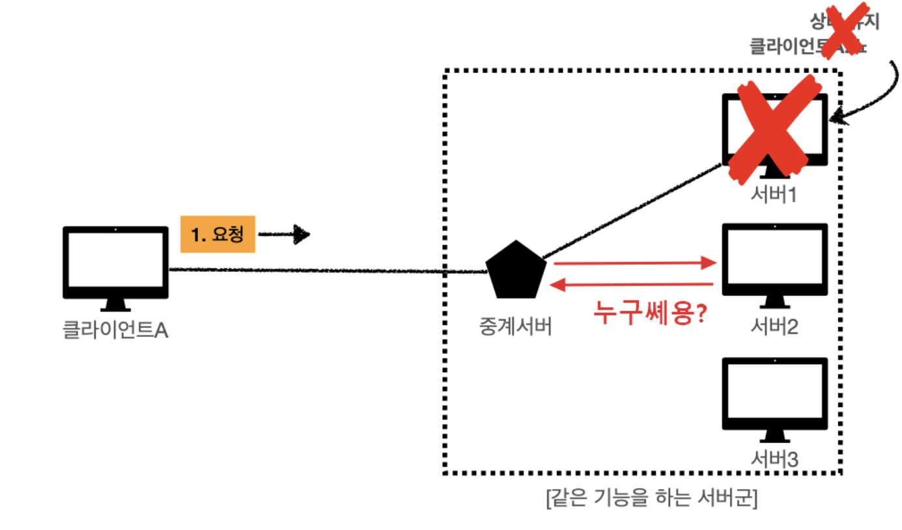
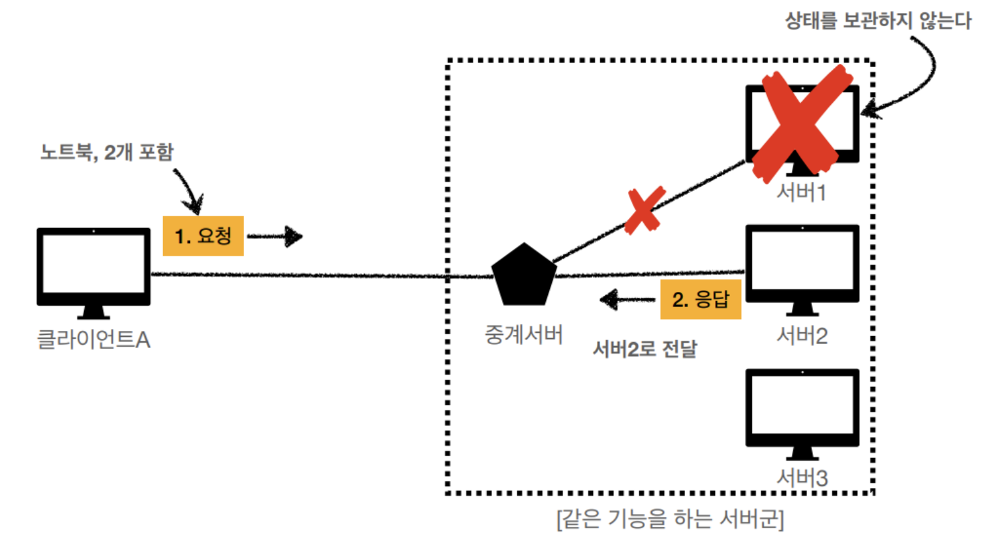

- Spring Security가 무엇인가?

  **자바 기반 웹 애플리케이션의 인증과 인가,
  그리고 보안 위협으로부터의 보호를 처리하는 강력한 보안 프레임워크**

    - 특징
        - Filter 기반으로 동작하여 MVC와 구분하여 관리 및 동작한다.
        - 어노테이션을 통해 간단하게 설정할 수 있다.
        - 세션 & 쿠키방식으로 인증한다.
        - 다양한 인증 매커니즘 지원
            - HTTP 기본, OAuth2 등
        - CSRF 보호
            - CSRF토큰을 사용하여 공격에 대해 보호한다.

    - 용어
        - Authentication: 인증
        - Authorization: 인가
        - Principal: 접근주체 / 시스템에 접근하는 사용자
        - Role: 권한

      인증→접근주체 생성 / 접근주체 → 권한 부여 / 권한 → 인가 결정

    - 장단점
        - Servlet API 통합
        - 자바 confiduration 지원
        - 인증, 인가를 확장 가능
        - 프레임워크 종속
            - 많은 설정 파일과 커스터마이징 요구
        - 학습곡선이 높다

- 인증(Authentication)vs 인가(Authorization)

  ### 인증

  본인이 누구인지 확인

    - 인증방식
        - 쿠키방식
            - 사용자 인증에 대해 브라우저에서 사용자 정보를 저장하는 방식
        - 세션방식
            - 사용자 인증에 대해 서버 특에서 유저의 인증정보(세션)를 생성하고
              클라이언트 측에 인증정보 ID를 전달하여 쿠키가 저장하는 방식
            - Stateful 방식이다. 클라이언트의 상태를 서버에 유지한다.
        - 토큰방식
            - 사용자의 인증에 대해 서버 측에서 유저에게 토큰을 발급해주고,
              클라이언트 측에서는 토큰을 저장해서 요청 시마다 토큰을 함께 서버에 전달하는 방식
            - 쿠키를 사용하지 않으므로 Stateless 상태로 확장성 증가 가능

    - 대표적인 토큰 기반 인증 방식
        - OAuth
        - JWT

  ### 인가

  특정 리소스에 권한이 있는지 확인

    - 인가방식
        - Access Control List(ACL)
            - 사용자에게 직접 권한을 부여하는 방식
        - RBAC(role-based access control)
            - 역할에 따른 접근 가능한 리소스를 할당하고 그에 따라 각각의
              클라이언트들에게 적절한 권한을 조합하여 부여하는 방식
            - ex) 일반 관리자에게 할당된 리소스: 사용자 관리, 게시물 관리, 회원가입 승인

    - 차이점
        - 신분증 → 계좌에 접근하기 위한 인가에도 사용한다.
        - **⇒ 인증은 인가로 이어지지만, 인가는 인증으로 이어지지 않는다는 점이다.**
        - 인가가 개체를 식별하는 데 사용할 수 있는 것이 아니다.

- Stateful vs Stateless

  ### stateful 상태유지

  서버가 클라이언트의 상태를 보존한다.

  서버에서 클라이언트가 이전 단계에서 제공한 값을 저장하고 다음 단계에서도 저장한 상태이다.

  이러한 정보들은 브라우저의 쿠키에 저장되거나 서버의 세션 메모리에 저장되어 상태를 유지하게 된다.

    - TCP 3-way handshaking
        - syn(client) → syn/ack(server) →ack(client)

    - 문제점
        - 해당 서버가 멈추거나 여러 이유로 해당 서버를 못 쓰게 되었을 때 문제가 발생한다.
        - ex) 글쓰기 버튼을 눌렀는데 다시 로그인하라는 화면이 뜬다.

     

  ### stateless 무상태성
    
   서버가 클라이언트의 상태를 보존하지 않는다.
    
   서버는 단순히 요청이 오면 응답을 보내는 역할만 수행
    
   통신에 필요한 모든 상태 정보들은 클라이언트에서 가지고 있다가 서버와 통신할 때 데이터를 실어 보내는 것
    
   
    
   - 서버 확장을 통해 대용량 트래픽에도 대응할 수 있다.
   - UTP, HTTP 프로토콜
   - 토큰
      - 로그인 유지와 같은 상태는 stateful한 상태여야 한다.
       ⇒ stateless 특징을 유지하면서도 로그인 상태 유지를 가능하게 하는 기술 JWT
       클라이언트가 암호화된 로그인 정보를 지니고 있다가 서버에 통신할 때 넘겨준다.
    
   - 문제점
        - 최종 목적을 위해 지나는 과정마다 점점 전달해야 하는 내용이 많아진다.