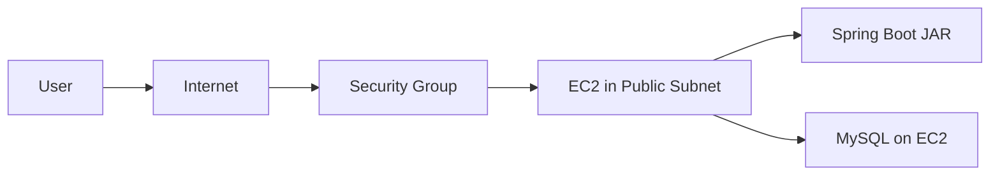
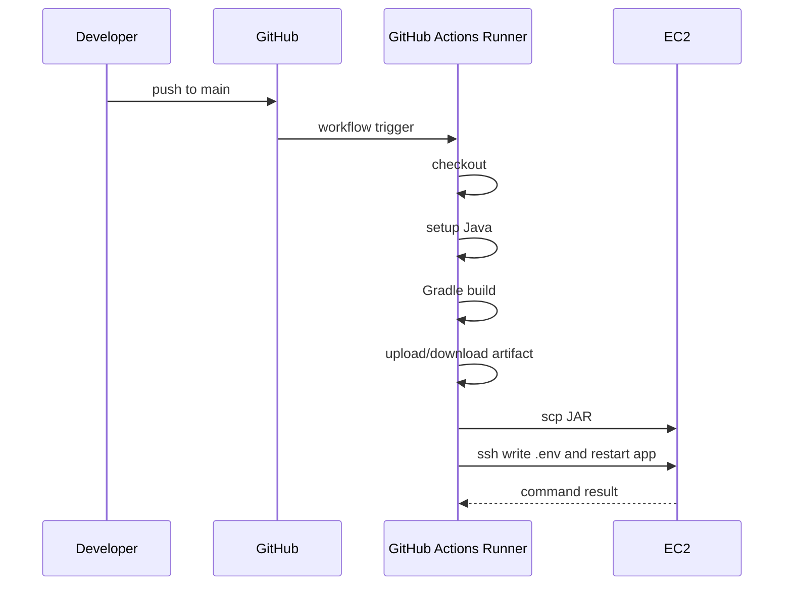

# 1. 클라우드 컴퓨팅이란?

## 한 줄 정의

클라우드 컴퓨팅은 서버, 저장소, 네트워크, 데이터베이스 같은 IT 자원을 직접 소유하지 않고 인터넷을 통해 필요한 만큼 빌려 쓰는 방식이다.

물리 서버를 직접 구매하고 운영하는 대신, 컴퓨팅 자원을 서비스처럼 사용하는 것이다. 필요할 때 서버를 만들고, 사용량이 늘면 자원을 늘리고, 필요 없어지면 줄이거나 제거할 수 있다.

---

## 왜 필요한가

로컬에서 Spring Boot를 실행하면 내 컴퓨터에서만 서비스가 동작한다.

```text
localhost:8080
-> 내 컴퓨터에서는 접속 가능
-> 다른 사용자는 접속 불가
-> 컴퓨터를 끄면 서비스도 종료
```

서비스를 다른 사람이 쓰게 하려면 항상 켜져 있고 외부 네트워크에서 접근 가능한 서버가 필요하다. 예전에는 직접 서버 장비를 구매하고 데이터센터에 설치해야 했다. 하지만 처음 학습하거나 작은 서비스를 만드는 입장에서 이 방식은 너무 무겁다.

클라우드를 쓰면 다음이 가능해진다.

```text
필요할 때 서버 생성
-> 사용량이 늘면 서버 성능/개수 조정
-> 필요 없어지면 삭제
-> 사용한 만큼 비용 지불
```

클라우드의 중요한 장점은 고정 비용을 사용량 기반 비용으로 바꿀 수 있고, 처음부터 서버 용량을 정확히 예측하지 않아도 된다는 점이다. 서비스가 작을 때는 작게 시작하고, 사용량이 늘 때 점진적으로 키울 수 있다.

---

## IaaS, PaaS, SaaS

클라우드를 공부할 때 가장 먼저 보는 축은 "내가 어디까지 관리하는가"이다.

| 구분 | 내가 관리하는 것 | 클라우드가 많이 해주는 것 | 예시 |
|---|---|---|---|
| IaaS | OS, 런타임, 앱, 데이터 | 서버/스토리지/네트워크 제공 | EC2, Google Compute Engine |
| PaaS | 앱과 일부 설정 | OS, 런타임, 배포 플랫폼 | Elastic Beanstalk, App Runner, Google App Engine |
| SaaS | 사용 설정 정도 | 거의 전체 | Gmail, Notion, Slack |

여기서 주의할 점은 "AWS는 PaaS다"처럼 하나로 단정하면 안 된다는 것이다. AWS는 클라우드 서비스들의 집합이고, 그 안에 IaaS 성격의 EC2, 관리형 DB인 RDS, 객체 스토리지인 S3, PaaS에 가까운 App Runner/Elastic Beanstalk 같은 여러 서비스가 같이 있다.

Spring Boot 애플리케이션을 EC2에 직접 배포하는 방식은 IaaS 사용에 가깝다.

```text
EC2
-> 가상 서버만 빌림
-> Java 설치도 내가 함
-> MySQL 설치도 내가 함
-> JAR 실행도 내가 함
-> 프로세스 관리도 내가 함
```

---

## 공부하면서 얻어갈 점

> **클라우드는 "남의 컴퓨터"라는 말로 시작할 수 있지만, 실제로는 운영 책임을 어디까지 넘길지 고르는 선택지다.**  
> EC2를 쓰면 자유도는 높지만 OS, 런타임, 프로세스, 보안을 직접 챙겨야 한다. PaaS나 관리형 서비스를 쓰면 자유도는 줄지만 운영 부담이 줄어든다.

> **비용은 기능이 아니라 요구사항이다.**  
> 클라우드는 리소스를 쉽게 만들 수 있어서 좋지만, 쉽게 비용도 생긴다. 배포 환경에서는 리전, public IPv4, NAT Gateway, RDS, 스냅샷, Elastic IP, 로그 저장 비용을 같이 보는 습관을 들이는 편이 좋다.

---

# 2. AWS? GCP?

## 한 줄 정의

AWS와 GCP는 대표적인 클라우드 서비스 제공자이다. 둘은 서비스 이름과 세부 사용법은 다르지만, 서버, 데이터베이스, 스토리지, 네트워크, 권한 관리 같은 핵심 역할을 제공한다는 점은 비슷하다.

여기서는 AWS와 GCP의 큰 역할 매핑, 그리고 Spring Boot 배포에 자주 등장하는 AWS 구성요소를 중심으로 잡는다.

AWS는 클라우드 인프라 학습에서 기준점으로 삼기 좋은 편이다. 다른 클라우드가 AWS를 그대로 따라 했다는 뜻은 아니지만, AWS가 먼저 대중화한 서비스 범주가 많아서 `EC2는 가상 서버`, `S3는 객체 스토리지`, `RDS는 관리형 관계형 DB`처럼 역할을 잡아두면 GCP, OCI, Naver Cloud의 대응 서비스를 이해하기 쉬워진다.

---

## 어떻게 비교해야 할까

처음에는 어떤 클라우드가 더 좋은지보다, 같은 역할의 서비스 이름을 매핑하는 것이 중요하다.

| 역할 | AWS | GCP |
|---|---|---|
| 가상 서버 | EC2 | Compute Engine |
| 관리형 관계형 DB | RDS | Cloud SQL |
| 객체 스토리지 | S3 | Cloud Storage |
| 서버리스 컨테이너 실행 | App Runner, ECS Fargate | Cloud Run |
| 네트워크 공간 | VPC | VPC |
| 권한 관리 | IAM | IAM |

즉 `AWS를 공부한다`는 것은 단순히 AWS 버튼 위치를 외우는 것이 아니라, 클라우드에서 필요한 역할을 이해하는 것이다.

```text
서버가 필요하다
-> EC2

DB를 분리하고 싶다
-> RDS

이미지/파일을 저장하고 싶다
-> S3

서버들이 들어갈 네트워크가 필요하다
-> VPC / Subnet / Security Group
```

---

## Spring Boot 배포에서 필요한 AWS 최소 지도

Spring Boot를 EC2에 직접 배포하는 기본 흐름은 아래처럼 이해할 수 있다.



각 요소의 역할은 다음과 같다.

| 요소 | 기본 역할 | 더 공부할 때 확장되는 방향 |
|---|---|---|
| Region | 서버를 어느 지역에 둘지 선택 | 사용자와 가까운 지역, 장애 대응, 비용 |
| VPC | AWS 안의 내 네트워크 공간 | public/private subnet 분리 |
| Subnet | EC2가 실제로 놓이는 네트워크 구역 | DB는 private subnet에 두는 구조 |
| Security Group | 22, 8080 같은 접근 포트 제어 | 최소 포트만 열기, source 제한 |
| EC2 | Spring Boot JAR가 실행되는 서버 | systemd, Docker, ECS로 확장 |
| RDS | DB를 EC2 밖으로 분리할 때 사용 | 백업, 장애 대응, private DB |
| S3 | 이미지/파일을 서버 밖에 저장할 때 사용 | presigned URL, bucket policy |

초기 학습용 구조에서는 EC2 한 대에 Spring Boot와 MySQL을 같이 둘 수 있다. 이 구조는 이해하기 쉽지만, 실무에서는 보통 애플리케이션 서버와 DB, 파일 저장소를 분리한다.

```text
단순 배포 구조
-> EC2 한 대
-> Spring Boot + MySQL
-> 단순하고 빠르게 이해 가능

실무에 가까운 구조
-> EC2/ECS에서 Spring Boot 실행
-> RDS에 DB 저장
-> S3에 이미지/파일 저장
-> public/private subnet 분리
```

---

## 면접 포인트

```text
Q. AWS와 GCP를 어떻게 비교할 수 있나요?
A. 특정 서비스 이름보다 역할로 비교하는 것이 좋다. 예를 들어 AWS EC2는 GCP Compute Engine, AWS RDS는 GCP Cloud SQL, AWS S3는 GCP Cloud Storage와 비슷한 역할을 한다.
```

```text
Q. EC2에 MySQL을 같이 설치하는 것과 RDS를 쓰는 것은 무엇이 다른가요?
A. EC2에 직접 설치하면 단순하지만 백업, 복구, 장애 대응, 보안 패치를 직접 챙겨야 한다. RDS는 DB 운영 기능을 관리형 서비스로 제공하므로 운영 부담을 줄일 수 있다.
```

```text
Q. VPC와 Security Group을 왜 알아야 하나요?
A. 배포는 앱을 실행하는 것만이 아니라 누가 어떤 포트로 접근할 수 있는지 정하는 일이기 때문이다. VPC는 네트워크 공간이고, Security Group은 리소스 단위 접근 규칙이다.
```

---

## 공부하면서 얻어갈 점

> **AWS와 GCP 비교는 우열보다 서비스 매핑으로 공부하는 편이 좋다.**  
> EC2와 Compute Engine, RDS와 Cloud SQL, S3와 Cloud Storage처럼 역할을 대응시키면 다른 클라우드 문서를 읽을 때도 훨씬 덜 낯설다.

> **처음에는 EC2 중심으로 이해하고, 다음 단계에서 RDS/S3/VPC 분리를 공부하면 된다.**  
> 처음부터 모든 AWS 서비스를 깊게 파면 배포 자체가 흐려질 수 있다. 초기 배포 학습에서는 "EC2에 앱을 올린다"를 중심으로 잡고, DB와 파일 저장소를 분리하는 이유를 다음 확장 포인트로 남기면 좋다.

---

# 3. 환경변수 처리 방법과 왜 환경변수로 민감 정보를 가려야 하는가?

## 한 줄 정의

환경변수와 Secrets는 민감정보나 환경별 설정을 코드 밖에서 주입하기 위한 방법이고, yml 환경 분리는 로컬/개발/운영 설정을 분리하는 방법이다.

```text
코드
-> 공통 로직

환경변수 / Secrets / application-prod.yml
-> 환경마다 바뀌는 값
```

---

## 왜 필요한가

아래 값들은 코드에 그대로 넣으면 안 된다.

```text
DB username
DB password
JWT secret
Kakao client secret
AWS access key
EC2 private key
```

이 값들이 GitHub에 올라가면 이미 유출된 것으로 봐야 한다.

```yaml
spring:
  datasource:
    username: root
    password: 1234
```

이런 설정은 로컬에서는 편하지만, public repository나 협업 환경에서는 위험하다.

그래서 설정을 이렇게 나눈다.

```text
application.yml
-> 구조와 기본값

application-local.yml
-> 로컬 개발용

application-prod.yml
-> 운영 환경용

.env 또는 OS 환경변수
-> 비밀값

GitHub Actions Secrets
-> CI/CD에서 쓰는 비밀값
```

---

# 4. yml 환경 분리 방법

## 한 줄 정의

yml 환경 분리는 하나의 Spring Boot 애플리케이션을 로컬, 개발, 운영처럼 서로 다른 실행 환경에서 안전하게 실행하기 위해 설정 파일을 나누는 방법이다.

```text
application.yml
-> 공통 설정

application-local.yml
-> 로컬 개발 설정

application-prod.yml
-> 운영 배포 설정
```

---

## Spring Boot의 외부 설정

Spring Boot는 properties, YAML, 환경변수, command line argument 같은 여러 방식으로 설정을 외부에서 주입할 수 있다. 같은 코드라도 실행 환경에 따라 다른 설정을 주입할 수 있다는 뜻이다.

Spring Boot는 profile-specific 파일도 지원한다.

```text
application.yml
application-local.yml
application-prod.yml
```

예를 들어 `prod` profile을 활성화하면 `application.yml`과 `application-prod.yml`이 함께 고려된다.

```bash
java -jar app.jar --spring.profiles.active=prod
```

또는 환경변수로 지정할 수 있다.

```bash
SPRING_PROFILES_ACTIVE=prod java -jar app.jar
```

---

## `.env`는 Spring Boot가 자동으로 읽는 파일이 아니다

`.env`를 설정 파일로 읽을 때 중요한 포인트가 있다.

```yaml
spring:
  config:
    import: optional:file:.env[.properties]
```

Spring Boot가 `.env`를 자동으로 읽는다고 생각하면 안 된다. `.env`를 쓰려면 위처럼 `spring.config.import`로 가져오거나, dotenv 라이브러리 또는 배포 환경의 OS 환경변수를 사용해야 한다.

추가 설정 파일을 가져오려면 `spring.config.import`를 사용할 수 있다. 예를 들어 `.env` 파일을 properties 파일처럼 읽게 만들면, 배포 서버에 있는 환경값을 애플리케이션 설정으로 연결할 수 있다.

이때 `.env`는 보통 Java properties처럼 읽힌다고 생각하면 된다.

```properties
DB_USER=demo
DB_PASSWORD=1234
JWT_SECRET_KEY=...
```

값에 공백이나 특수 문자가 많다면 quoting 규칙을 조심해야 한다. 특히 이전에 JWT 토큰을 Swagger Authorization에 넣을 때 따옴표까지 같이 넣어서 문제가 생겼던 것처럼, "값 자체에 따옴표가 포함되는지"와 "문법상 따옴표를 쓰는지"는 구분해야 한다.

---

## GitHub Actions Secrets

GitHub Actions는 GitHub repository에서 발생하는 이벤트를 기준으로 build, test, deployment pipeline을 실행하는 자동화 도구이다.

EC2에 SSH로 배포하는 workflow에서는 보통 다음 값을 GitHub Secrets에 둔다.

```text
EC2_SSH_KEY
EC2_USERNAME
EC2_HOST
ENV
```

workflow에서는 다음처럼 꺼내 쓴다.

```yaml
env:
  EC2_SSH_KEY: ${{ secrets.EC2_SSH_KEY }}
  EC2_USERNAME: ${{ secrets.EC2_USERNAME }}
  EC2_HOST: ${{ secrets.EC2_HOST }}
  ENV: ${{ secrets.ENV }}
```

GitHub Actions Secrets에 저장한 값은 workflow 안에서 `secrets` context로 꺼내 쓸 수 있다. 다만 secret은 "보이지 않게 저장한다"는 의미이지, 아무렇게나 출력하거나 오래된 키를 계속 써도 된다는 뜻은 아니다.

실무에서는 장기 SSH key나 cloud access key를 직접 저장하는 방식 대신, OIDC를 통해 cloud provider에서 짧은 수명의 임시 권한을 발급받는 방식도 많이 고려한다.

처음 SSH 기반 배포를 구성할 때는 SSH private key를 GitHub Secrets에 넣는 방식이 쉽다. 하지만 실무에서는 다음 주제도 같이 나온다.

```text
장기 SSH key를 GitHub에 넣어도 되는가?
GitHub Actions runner가 직접 서버에 접근해도 되는가?
OIDC로 AWS role을 임시 발급받는 방식은 어떤 장점이 있는가?
배포 권한을 production 환경에만 제한할 수 있는가?
```

---

## 면접 포인트

```text
Q. 왜 민감정보를 application.yml에 직접 넣으면 안 되나요?
A. 코드 저장소에 올라가면 접근 권한을 가진 사람이나 public 노출을 통해 비밀값이 유출될 수 있다. 또한 환경별로 값이 달라져야 하므로 코드와 설정을 분리하는 편이 안전하고 운영하기 쉽다.
```

```text
Q. 환경변수와 GitHub Actions Secrets는 같은 건가요?
A. 같은 층위는 아니다. GitHub Actions Secrets는 GitHub workflow에서 민감값을 안전하게 저장하기 위한 기능이고, workflow 실행 중에는 이 값을 환경변수처럼 주입해서 사용할 수 있다.
```

```text
Q. application-local.yml과 application-prod.yml을 왜 나누나요?
A. 로컬 DB, 운영 DB, 로그 레벨, ddl-auto, OAuth redirect-uri, 서버 포트처럼 환경별로 달라지는 값을 분리하기 위해서다. 같은 코드가 환경만 바꿔 실행될 수 있어야 한다.
```

---

## 공부하면서 얻어갈 점

> **비밀값은 숨기는 것이 아니라 수명과 접근 권한을 관리하는 것이다.**  
> `.env`에 넣었다고 끝이 아니다. 누가 읽을 수 있는지, 로그에 찍히는지, GitHub에 올라가는지, 만료/교체할 수 있는지까지 봐야 한다.

> **Spring Boot 설정은 코드의 일부처럼 중요하다.**  
> 배포 실패의 많은 부분은 코드 오류가 아니라 profile, DB URL, port, secret, file path 같은 설정 문제에서 나온다.

> **`.env` import는 로컬 또는 단순 배포 환경에서 쓰기 쉬운 편의 장치다.**  
> 실무에서는 OS 환경변수, GitHub Actions Secrets, AWS Secrets Manager, Parameter Store, Kubernetes Secret 등으로 발전할 수 있다.

---

# 5. CI/CD와 GitHub Actions

## 한 줄 정의

CI/CD는 코드를 통합하고, 빌드하고, 테스트하고, 배포하는 과정을 자동화하는 흐름이다. GitHub Actions는 GitHub repository 이벤트를 기준으로 이 흐름을 실행하는 자동화 도구이다.

```text
CI
-> build, test, lint, static analysis

CD
-> artifact 생성, 서버 업로드, 배포, 재시작, 검증
```

---

## 왜 필요한가

수동 배포는 처음에는 쉬워 보인다.

```text
로컬에서 빌드
-> JAR 파일 찾기
-> scp로 서버에 전송
-> ssh 접속
-> 기존 프로세스 종료
-> 새 JAR 실행
-> 로그 확인
```

하지만 사람이 직접 하면 매번 실수 가능성이 생긴다.

```text
잘못된 브랜치를 배포
JAR 파일을 잘못 선택
서버에서 기존 프로세스를 못 죽임
환경변수를 빠뜨림
로그를 확인하지 않음
```

GitHub Actions workflow로 만들면 이 과정을 재현 가능하게 남길 수 있다.



---

## GitHub Actions 기본 단위

GitHub Actions는 workflow, event, job, step, action, runner 같은 단위로 구성된다.

| 단위 | 의미 | 예시 |
|---|---|---|
| Workflow | 자동화 전체 파일 | `.github/workflows/deploy.yml` |
| Event | workflow를 시작하는 사건 | `push` to `main` |
| Job | runner에서 실행되는 작업 묶음 | `build`, `deploy` |
| Step | job 안의 개별 명령 | checkout, setup-java, gradle build |
| Action | 재사용 가능한 step | `actions/checkout@v4` |
| Runner | job을 실행하는 서버 | `ubuntu-latest` |
| Artifact | job 사이에 전달되는 산출물 | `build/libs/*.jar` |

JAR 배포 workflow에서 `build` job과 `deploy` job을 나누는 이유는 역할을 분리하기 위해서다.

```text
build job
-> 코드 체크아웃
-> Java 설정
-> Gradle build
-> JAR artifact 업로드

deploy job
-> artifact 다운로드
-> SSH key 준비
-> EC2로 JAR 전송
-> EC2에서 앱 재시작
```

---

## CD에서 조심할 점

단순 JAR 배포 스크립트는 학습용으로 매우 직관적이다.

```bash
pgrep java | xargs -r kill -15
sleep 10
nohup java -jar /home/$EC2_USERNAME/BackEnd.jar > app.log 2>&1 &
```

하지만 실무에서는 이런 질문이 이어진다.

```text
Java 프로세스가 여러 개면 전부 종료해도 되는가?
앱이 완전히 뜨기 전에 성공 처리되면 어떻게 되는가?
배포 중 요청은 어떻게 처리되는가?
새 버전 실행에 실패하면 이전 버전으로 돌아갈 수 있는가?
로그는 app.log 하나로 충분한가?
```

그래서 다음 단계로는 health check, systemd, reverse proxy, Docker, blue-green deployment, rolling deployment 같은 주제로 확장된다.

---

## 면접 포인트

```text
Q. CI와 CD의 차이는 무엇인가요?
A. CI는 변경된 코드가 기존 코드와 잘 통합되는지 빌드와 테스트로 확인하는 흐름이고, CD는 빌드 산출물을 실제 실행 환경에 배포하는 흐름이다.
```

```text
Q. GitHub Actions에서 job과 step의 차이는 무엇인가요?
A. job은 runner에서 실행되는 작업 묶음이고, step은 job 안에서 순서대로 실행되는 개별 명령 또는 action이다. job은 병렬/순차 실행과 의존성을 가질 수 있다.
```

```text
Q. 배포 자동화에서 가장 조심해야 하는 것은 무엇인가요?
A. secret 노출, 잘못된 대상 서버 배포, 실패 시 롤백 불가, 배포 후 검증 누락이다. 자동화는 반복을 줄이지만, 잘못된 자동화는 같은 실수를 빠르게 반복한다.
```

---

## 공부하면서 얻어갈 점

> **CI/CD는 "편하게 배포하기"보다 "같은 방식으로 반복 가능하게 배포하기"가 핵심이다.**  
> 사람이 손으로 하던 일을 YAML로 적는 순간, 배포 과정이 문서이자 코드가 된다.

> **배포 스크립트도 프로덕션 코드처럼 리뷰해야 한다.**  
> `rm`, `kill`, `scp`, `ssh`, secret 출력 같은 줄은 작은 실수로도 큰 영향을 만들 수 있다.

> **처음에는 JAR 배포로 충분하지만, 다음 질문을 남겨야 한다.**  
> 무중단 배포, 롤백, health check, 로그 수집, 모니터링을 어떻게 할 것인지는 다음 단계의 배포 공부 주제가 된다.

---

# 6. Docker와 .jar vs Docker 이미지

## 한 줄 정의

`.jar` 배포는 Java 실행 파일을 서버에 올려 서버의 Java 런타임으로 실행하는 방식이고, Docker image 배포는 애플리케이션과 실행 환경을 이미지로 포장해서 container로 실행하는 방식이다.

Docker는 애플리케이션을 일정한 실행 환경으로 포장하고 실행하기 위한 도구이다. Docker image는 컨테이너 실행에 필요한 파일, 바이너리, 라이브러리, 설정을 담은 패키지이고, Docker container는 그 image를 실제로 실행한 격리된 프로세스이다.

---

## 왜 필요한가

JAR 배포에서는 서버 환경이 중요하다.

```text
EC2
-> Java 21 설치되어 있어야 함
-> 필요한 OS package 설치되어 있어야 함
-> .env 위치가 맞아야 함
-> 실행 명령이 맞아야 함
```

Docker image 배포에서는 실행 환경을 이미지 안에 더 많이 담는다.

```text
Dockerfile
-> base image
-> app.jar copy
-> 실행 명령
-> port
```

그 결과 "내 컴퓨터에서는 되는데 서버에서는 안 된다"를 줄일 수 있다.

```text
JAR 배포
-> 서버마다 Java 버전/환경 차이가 문제될 수 있음

Docker image 배포
-> image가 같으면 실행 환경도 대부분 같음
```

---

## JAR, Image, Container 구분

| 구분 | 의미 | 비유 |
|---|---|---|
| JAR | Java 애플리케이션 실행 파일 | 완성된 프로그램 파일 |
| Dockerfile | image 만드는 레시피 | 조리법 |
| Docker image | 실행 환경과 앱을 담은 읽기 전용 템플릿 | 포장된 제품 |
| Docker container | image를 실행한 실제 프로세스 | 제품을 꺼내 실행한 상태 |
| Registry | image 저장소 | Docker Hub, ECR |

JAR 배포 흐름은 이렇다.

```text
Gradle build
-> app.jar
-> EC2로 복사
-> java -jar app.jar
```

Docker 배포 흐름은 이렇다.

```text
Gradle build
-> app.jar
-> docker build
-> image push
-> 서버에서 image pull
-> docker run
```

---

## 언제 JAR가 좋고 언제 Docker가 좋을까

| 상황 | JAR 배포 | Docker 배포 |
|---|---|---|
| 첫 배포 학습 | 이해하기 쉽다 | Docker까지 같이 배워야 해서 조금 무겁다 |
| 서버 한 대 | 충분히 가능 | 가능하지만 약간 과할 수 있음 |
| 환경 일관성 | 서버 설정에 의존 | image로 고정하기 좋음 |
| 여러 서버/컨테이너 플랫폼 | 관리 어려움 | ECS/Kubernetes와 연결 자연스러움 |
| 롤백 | JAR 보관 전략 필요 | image tag 기반 롤백이 자연스러움 |
| 운영 표준화 | systemd 등 추가 필요 | container 단위 운영에 유리 |

처음 배포 원리를 익힐 때는 JAR 배포가 적합하다. 서버에서 애플리케이션이 어떤 파일로 실행되는지 직접 확인하기 쉽기 때문이다.

하지만 이후에는 Docker로 넘어가면 다음이 좋아진다.

```text
개발/운영 환경 차이 감소
이미지 태그로 버전 관리
ECS, Kubernetes 같은 컨테이너 플랫폼으로 확장
CI/CD에서 artifact가 JAR에서 image로 변화
```

---

## Spring Boot와 Docker

Spring Boot는 JAR만 만들 수 있는 것이 아니라 container image 생성 흐름과도 연결된다. 즉 배포 산출물을 JAR로 둘 수도 있고, Docker image로 만들어 registry에 올린 뒤 서버에서 pull해서 실행할 수도 있다.

처음에는 아래 순서로 공부하면 좋다.

```text
1. JAR가 무엇인지 이해
2. java -jar로 실행
3. Dockerfile로 JAR를 image에 넣기
4. docker run으로 container 실행
5. docker compose로 app + DB 실행
6. registry에 push
7. EC2/ECS에서 pull/run
```

이 순서가 좋은 이유는 Docker를 마법 상자로 보지 않게 해주기 때문이다.

---

## 면접 포인트

```text
Q. Docker image와 container의 차이는 무엇인가요?
A. image는 실행 환경과 애플리케이션을 담은 읽기 전용 템플릿이고, container는 그 image를 실제로 실행한 프로세스이다.
```

```text
Q. JAR 배포보다 Docker 배포가 좋은 이유는 무엇인가요?
A. 서버 환경 차이를 줄이고, image tag로 버전을 관리하며, 컨테이너 오케스트레이션 도구와 연결하기 쉽다. 다만 단순한 서버 한 대 구성에서는 JAR 배포가 더 직관적일 수 있다.
```

```text
Q. Docker를 쓰면 보안이나 운영 문제가 자동으로 해결되나요?
A. 아니다. image 취약점, secret 주입, 권한, network, volume, logging, resource limit을 여전히 관리해야 한다. Docker는 실행 단위를 표준화하는 도구이지 운영 책임을 없애는 도구가 아니다.
```

---

## 공부하면서 얻어갈 점

> **JAR 배포는 배포의 원리를 배우기 좋고, Docker 배포는 배포 단위를 표준화하기 좋다.**  
> 처음부터 Docker만 보면 서버에서 실제로 무엇이 실행되는지 흐려질 수 있다. JAR 배포를 한 번 해본 뒤 Docker로 넘어가면 container가 왜 필요한지 더 잘 보인다.

> **Docker image는 "코드"가 아니라 "실행 가능한 환경 패키지"에 가깝다.**  
> Java 버전, OS layer, JAR, 실행 명령이 image에 담긴다. 그래서 배포 artifact가 JAR에서 image로 바뀌면 운영 방식도 달라진다.

# 참고 자료

- [AWS - What is cloud computing?](https://aws.amazon.com/what-is-cloud-computing/)
- [AWS - Six advantages of cloud computing](https://docs.aws.amazon.com/whitepapers/latest/aws-overview/six-advantages-of-cloud-computing.html)
- [Google Cloud - What is Cloud Computing?](https://cloud.google.com/learn/what-is-cloud-computing)
- [AWS EC2 - What is Amazon EC2?](https://docs.aws.amazon.com/AWSEC2/latest/UserGuide/concepts.html)
- [AWS EC2 - Regions and Zones](https://docs.aws.amazon.com/AWSEC2/latest/UserGuide/using-regions-availability-zones.html)
- [AWS VPC - What is Amazon VPC?](https://docs.aws.amazon.com/vpc/latest/userguide/what-is-amazon-vpc.html)
- [AWS VPC - Subnets for your VPC](https://docs.aws.amazon.com/vpc/latest/userguide/configure-subnets.html)
- [AWS VPC - Internet Gateway](https://docs.aws.amazon.com/vpc/latest/userguide/VPC_Internet_Gateway.html)
- [AWS EC2 - Security Groups](https://docs.aws.amazon.com/AWSEC2/latest/UserGuide/ec2-security-groups.html)
- [AWS RDS - What is Amazon RDS?](https://docs.aws.amazon.com/AmazonRDS/latest/UserGuide/Welcome.html)
- [AWS S3 - What is Amazon S3?](https://docs.aws.amazon.com/AmazonS3/latest/userguide/Welcome.html)
- [AWS IAM - What is IAM?](https://docs.aws.amazon.com/IAM/latest/UserGuide/introduction.html)
- [AWS Well-Architected Framework](https://docs.aws.amazon.com/wellarchitected/latest/framework/welcome.html)
- [GitHub Actions - Understanding GitHub Actions](https://docs.github.com/en/actions/get-started/understand-github-actions)
- [GitHub Actions - Using secrets in GitHub Actions](https://docs.github.com/en/actions/how-tos/write-workflows/choose-what-workflows-do/use-secrets)
- [Spring Boot - Externalized Configuration](https://docs.spring.io/spring-boot/reference/features/external-config.html)
- [Spring Boot Gradle Plugin - Packaging Executable Archives](https://docs.spring.io/spring-boot/gradle-plugin/packaging.html)
- [Docker Docs - What is Docker?](https://docs.docker.com/get-started/docker-overview/)
- [Docker Docs - What is an image?](https://docs.docker.com/get-started/docker-concepts/the-basics/what-is-an-image/)
- [Docker Docs - What is a container?](https://docs.docker.com/get-started/docker-concepts/the-basics/what-is-a-container/)
