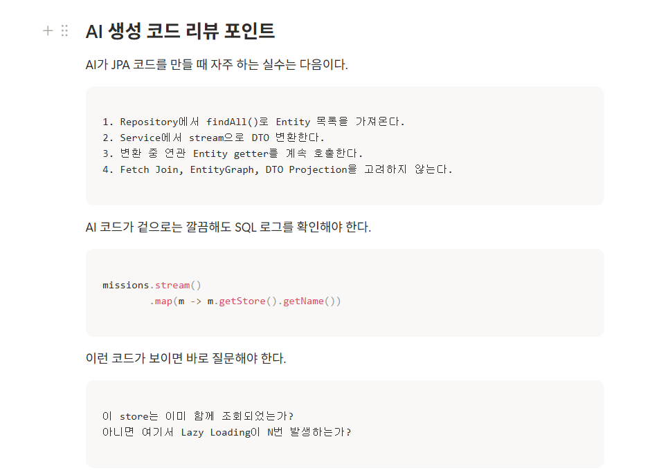

### 리뷰 작성 API

### 마이 페이지 조회 API

### 미션 목록 조회 API

### 홈 화면 조회 API

### 피어리뷰

<aside>
AI가 코드를 꽤 그럴듯하게 만들어줘서 그냥 넘어가기 쉬운데, 이런 부분을 짚어주셔서, 앞으로는 N+1 문제 뿐만 아니라 성능에 이슈를 줄 수 있는 부분은 직접 확인해야겠다는 생각이 들었습니다!

</aside>